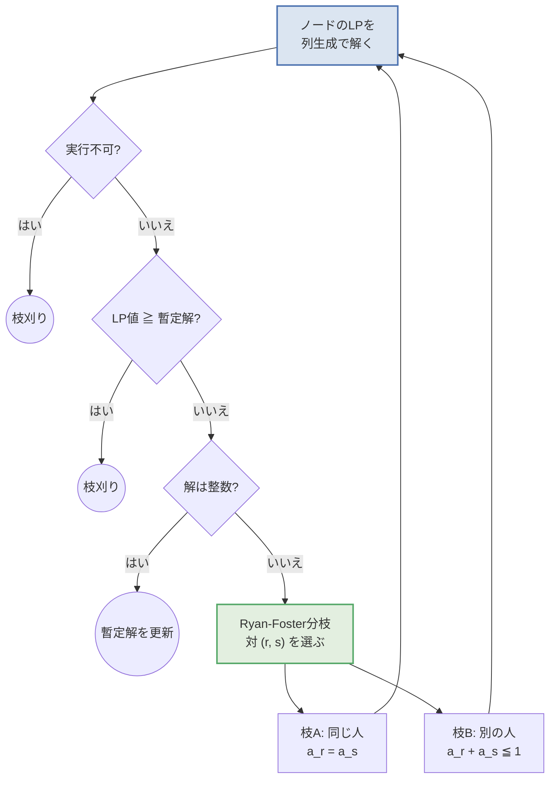

## この記事について

前回、**列生成法(Column Generation)** を扱いました。

@[card](https://zenn.dev/ctenopoma/articles/column-generation)

前回の結論はこうでした。

- 列(変数)が指数的に多い問題でも、**必要な列だけを都度作れば**LPは解ける
- ただし得られるのは **LP緩和の解**。整数解が欲しければ別の工夫がいる
- 実務的な折衷として「**生成された列だけを使って最後にMIPを解く**」という手がある

今回は、この折衷案が**明確に負ける例**を出したうえで、
正攻法である **分枝価格法(Branch-and-Price)** を実装します。

> 分枝価格法 = 分枝限定法(Branch-and-Bound) + 列生成(Column Generation)

「分枝限定法の各ノードで列生成を回す」だけ……に見えて、
素直にやると**壊れます**。なぜ壊れるのか、どう直すのかが今回の主題です。

:::message
コードはすべて手元で実行して結果を確認しています。
環境は Python 3.14 / PySCIPOpt 6.2.1 / SCIP 10.0 です。
:::

## 題材: 1日の現場作業を、何人で回せるか

今回はカッティングストックから離れて、**人の割り当て**を扱います。

設備点検の会社を考えます。今日やるべき作業が9件あり、それぞれ所要時間が決まっています。
作業員1人が働けるのは1日480分(8時間)。


| 作業 | J1 | J2 | J3 | J4 | J5 | J6 | J7 | J8 | J9 |
| ---- | ---- | ---- | ---- | ---- | ---- | ---- | ---- | ---- | ---- |
| 所要時間(分) | 250 | 240 | 210 | 190 | 170 | 150 | 140 | 130 | 120 |

合計 1600分。単純に480で割ると 3.33 なので、**最低でも4人**は必要です。
では4人で本当に回せるのか、それとも5人必要なのか。
**1人分の人件費**がかかっているので、これは毎日効いてくる差です。

### 「1人分の担当セット」を列にする

前回と同じ発想で定式化します。

> 列(パターン) = **作業員1人が1日に担当する作業の組み合わせ**
> 例: 「J1(250分) + J4(190分) = 440分」→ 480分以内なのでOK

$$
\begin{aligned}
\min_{x} \quad & \sum_{p \in P} x_p & & \text{(必要な作業員の人数)}\\
\text{s.t.} \quad & \sum_{p \in P} a_{jp}\, x_p = 1 & & \forall j \text{(作業 } j \text{ はちょうど1人が担当)}\\
& x_p \ge 0
\end{aligned}
$$

制約が `= 1`(集合分割)になっている以外は、前回のカッティングストックと同じ形です。
価格付け問題も同じくナップサック、ただし今回は各作業を最大1回しか入れられないので
**0-1ナップサック**になります。

$$
\max_{a \in \{0,1\}^n} \sum_j y_j a_j \quad \text{s.t.} \quad \sum_j t_j a_j \le 480
$$

## まず列生成だけをやってみる

前回のコードとほぼ同じものを回すと、LPの最適値は **3.667人** になりました。


「J1とJ4のチームを 0.667人分」「J7,J8,J9のチームを 0.333人分」……。
当然ながら**現場には出せません**。0.667人という作業員はいないからです。

ここまでで分かったことは2つです。

- **下界**: 4人未満では絶対に無理($\lceil 3.667 \rceil = 4$)
- **未解決**: では4人で足りるのか?

## 前回の「折衷案」ではどうなるか

前回紹介した実務的な折衷 —— **生成された20本の列だけを使ってMIPを解く** —— を試すと、
答えは **5人** でした。


左が折衷案の5人。稼働率35%と31%の作業員が生まれてしまっています。
右が本当の最適解で、4人で回せます。

**1人分、25%の過剰見積もり**です。LP下界が4人だと分かっているので、
「4人でできるかもしれない」ことまでは分かるのに、
生成された列の中には4人で組める組み合わせが**入っていなかった**わけです。

:::message
これは前回の折衷案が悪いという話ではありません。
「LP最適解を作るのに役立つ列」と「整数解を作るのに役立つ列」は**別物**であり、
列生成は前者しか作ってくれない、というだけの話です。
だからこそ、整数解が本当に必要なら分枝しながら列を作り足す必要があります。
:::

## なぜ素朴な分枝は壊れるのか

「分枝限定法をやればいいのでは?」と考えると、まず思いつくのは
**分数になっている列 $x_p = 0.667$ で分枝する**ことです。

- 枝1: $x_p \ge 1$
- 枝2: $x_p \le 0$ (= この列は使わない)

枝2で事故が起きます。


マスター問題が「この列は使うな」と言われても、**価格付け問題はそれを知りません**。
価格付け問題はナップサックを解いて「一番割の良い切り方/組み合わせ」を返すだけなので、
**禁止されたはずの列をもう一度作って持ってきます**。追加 → また禁止 → また生成 …… の無限ループです。

:::message alert
これは机上の話ではありません。前回の記事で SCIP の Pricer プラグインを使ったとき、
マスター変数を整数にしただけで、SCIPが分枝を始めた瞬間に
同じパターンを延々と生成し続けて止まらなくなりました。
:::

問題の本質は、**分枝の情報が価格付け問題に伝わらないこと**です。
「特定の列を禁止する」という制約は、ナップサック問題の言葉で書けません
(書こうとすると「この組み合わせだけはダメ」という不自然な制約が必要で、
しかもそれが増えるほど部分問題が解けなくなります)。

## 解決策: 「列」ではなく「元の問題」で分枝する

分枝価格法の核心はここです。

> **分枝は、列の変数 $x_p$ ではなく、元の問題の言葉で行う。**
> そうすれば、分枝の条件がそのまま価格付け問題の制約になる。

この問題における「元の問題の言葉」とは何でしょうか。
答えは **「作業 $r$ と作業 $s$ を、同じ人が担当するかどうか」** です。

これは **Ryan-Foster分枝** と呼ばれる、集合分割問題の定番の分枝規則です。

LP解から、次の値を計算します。

$$
\sigma_{rs} = \sum_{p:\ a_{rp}=1,\ a_{sp}=1} x_p \quad (\text{作業 } r,s \text{ を同じ人が担当する度合い})
$$

LP解が分数なら、$\sigma_{rs}$ が分数になる作業の対 $(r, s)$ が必ず存在します。
今回の根ノードでは、J1 と J4 について $\sigma = 0.667$ でした。


分枝の2つの枝は、どちらも**価格付け問題に素直な制約として入ります**。

| 枝 | 意味 | 価格付け問題に追加する制約 | 手持ちの列 |
| ---- | ---- | ---- | ---- |
| A | J1とJ4は同じ人が担当 | $a_{J1} = a_{J4}$ | 片方だけ含む列を捨てる |
| B | J1とJ4は別の人が担当 | $a_{J1} + a_{J4} \le 1$ | 両方含む列を捨てる |

どちらも 0-1ナップサックのままなので、**部分問題の解きやすさが壊れません**。
これが「列で分枝する」場合との決定的な違いです。

そして2つの枝は

- **排他的**: 両方を同時に満たす解はない
- **網羅的**: どんな整数解も、必ずどちらかに入る

を満たすので、分枝限定法として正しく動きます。

## アルゴリズム全体像



ポイントは、**各ノードで列生成をやり直す**ことです。
親ノードで作った列はそのまま子に引き継ぎ(枝の条件に反するものは捨てる)、
そこから足りない列を追加で生成します。

## PySCIPOptで実装する

### マスター問題

分枝で列を捨てると、そのノードで**実行可能解が作れなくなる**ことがあります。
そこで各制約に人工変数(コスト `BIG`)を入れておき、
それが使われたらそのノードは実行不可能とみなします。

```python
from itertools import combinations
from pyscipopt import Model, quicksum, SCIP_PARAMSETTING

T = 480   # 1人あたりの稼働時間[分]
JOBS = [("J1", 250), ("J2", 240), ("J3", 210), ("J4", 190), ("J5", 170),
        ("J6", 150), ("J7", 140), ("J8", 130), ("J9", 120)]
NAMES = [j for j, _ in JOBS]
TIMES = [t for _, t in JOBS]
N = len(JOBS)
BIG = 100.0
EPS = 1e-6


def solve_master(columns, integer=False):
    """集合分割のマスター問題。integer=False なら LP として解いて双対価格も返す。"""
    m = Model("master")
    m.hideOutput()
    if not integer:
        m.setPresolve(SCIP_PARAMSETTING.OFF)
        m.setHeuristics(SCIP_PARAMSETTING.OFF)
        m.disablePropagation()

    vtype = "I" if integer else "C"
    x = [m.addVar(vtype=vtype, lb=0, obj=1.0) for _ in columns]
    # 人工変数: 使われたらそのノードは実行不可能
    art = [m.addVar(vtype=vtype, lb=0, obj=BIG) for _ in range(N)]
    m.setMinimize()

    cons = []
    for i in range(N):
        c = m.addCons(
            quicksum(columns[j][i] * x[j] for j in range(len(columns))) + art[i] == 1)
        cons.append(c)

    m.optimize()
    duals = None if integer else [m.getDualSolVal(c) for c in cons]
    return (m.getObjVal(), [m.getVal(v) for v in x],
            [m.getVal(v) for v in art], duals)
```

### 価格付け問題(分枝の条件つき)

ここが分枝価格法のキモです。分枝で決まった条件を、**そのまま制約として渡します**。

```python
def solve_pricing(duals, together, apart):
    """0-1ナップサック + 分枝で決まった「同じ人/別の人」の条件"""
    m = Model("pricing")
    m.hideOutput()
    a = [m.addVar(vtype="B", obj=duals[i]) for i in range(N)]
    m.setMaximize()
    m.addCons(quicksum(TIMES[i] * a[i] for i in range(N)) <= T)
    for r, s in together:
        m.addCons(a[r] == a[s])          # 同じ人 → 両方入るか、両方入らないか
    for r, s in apart:
        m.addCons(a[r] + a[s] <= 1)      # 別の人 → 同じ列には入れない
    m.optimize()
    return m.getObjVal(), [int(round(m.getVal(v))) for v in a]


def valid(col, together, apart):
    """手持ちの列が、このノードの条件を満たしているか"""
    return (all(col[r] == col[s] for r, s in together)
            and all(col[r] + col[s] <= 1 for r, s in apart))


def column_generation(pool, together, apart):
    """ノードのLPを列生成で解く"""
    cols = [c for c in pool if valid(c, together, apart)]   # 条件に反する列は捨てる
    for _ in range(300):
        obj, xs, arts, duals = solve_master(cols)
        val, new = solve_pricing(duals, together, apart)
        if 1 - val > -EPS or new in cols or sum(new) == 0:  # 被約費用が負の列はもう無い
            break
        cols.append(new)
    obj, xs, arts, duals = solve_master(cols)
    feasible = all(v < EPS for v in arts)
    return obj, xs, cols, feasible
```

### 分枝と探索

```python
def find_branch_pair(cols, xs):
    """Ryan-Foster: 「同じ人が担当する度合い」が分数の対を探す(0.5に近いものを選ぶ)"""
    best = None
    for r, s in combinations(range(N), 2):
        v = sum(x for c, x in zip(cols, xs) if c[r] == 1 and c[s] == 1)
        if EPS < v < 1 - EPS:
            d = abs(v - 0.5)
            if best is None or d < best[0]:
                best = (d, r, s, v)
    return None if best is None else (best[1], best[2], best[3])


incumbent = [None, None]     # [人数, 解]


def branch_and_price(pool, together, apart, depth=0, label="根ノード"):
    obj, xs, cols, feasible = column_generation(pool, together, apart)
    pad = "  " * depth

    if not feasible:
        print(f"{pad}{label}: 実行不可 -> 枝刈り")
        return
    # 目的関数は人数(整数)なので、LP値が「暫定解-1」を超えたらもう勝てない
    if incumbent[0] is not None and obj > incumbent[0] - 1 + EPS:
        print(f"{pad}{label}: LP={obj:.3f} -> 枝刈り(暫定解 {incumbent[0]:.0f}人)")
        return
    if all(abs(v - round(v)) < EPS for v in xs):
        print(f"{pad}{label}: LP={obj:.3f} -> 整数解!")
        if incumbent[0] is None or obj < incumbent[0] - EPS:
            incumbent[0] = obj
            incumbent[1] = [c for c, v in zip(cols, xs) if v > 0.5]
        return

    pair = find_branch_pair(cols, xs)
    if pair is None:
        return
    r, s, v = pair
    print(f"{pad}{label}: LP={obj:.3f} -> {NAMES[r]} と {NAMES[s]} で分枝"
          f"(同じ人が担当する度合い={v:.3f})")

    # 枝A: 同じ人が担当 / 枝B: 別の人が担当
    branch_and_price(cols, together | {(r, s)}, apart, depth + 1,
                     f"{NAMES[r]}と{NAMES[s]}は同じ人")
    branch_and_price(cols, together, apart | {(r, s)}, depth + 1,
                     f"{NAMES[r]}と{NAMES[s]}は別の人")


# --- 実行 ---
init = [[1 if i == j else 0 for i in range(N)] for j in range(N)]   # 1人1作業から開始

root_lp, root_x, root_cols, _ = column_generation(init, set(), set())
root_mip, r_x, _, _ = solve_master(root_cols, integer=True)
print(f"根ノードのLP = {root_lp:.3f} 人 (列 {len(root_cols)} 本)")
print(f"生成列だけのMIP = {root_mip:.0f} 人  <- 前回の折衷案\n")

incumbent[0] = root_mip                                            # 暫定解として使う
incumbent[1] = [c for c, v in zip(root_cols, r_x) if v > 0.5]
branch_and_price(root_cols, set(), set())

print(f"\n最適値 = {incumbent[0]:.0f} 人")
for c in incumbent[1]:
    jobs = [NAMES[i] for i in range(N) if c[i]]
    print("   ", jobs, sum(TIMES[i] for i in range(N) if c[i]), "分")
```

## 実行結果

```txt
根ノードのLP = 3.667 人 (列 20 本)
生成列だけのMIP = 5 人  <- 前回の折衷案

根ノード: LP=3.667 -> J1 と J4 で分枝(同じ人が担当する度合い=0.667)
  J1とJ4は同じ人: LP=3.667 -> J5 と J6 で分枝(同じ人が担当する度合い=0.667)
    J5とJ6は同じ人: LP=3.667 -> J2 と J3 で分枝(同じ人が担当する度合い=0.667)
      J2とJ3は同じ人: LP=3.667 -> J5 と J7 で分枝(同じ人が担当する度合い=0.333)
        J5とJ7は同じ人: LP=4.000 -> 整数解!
        J5とJ7は別の人: LP=4.000 -> 枝刈り(暫定解 4人)
      J2とJ3は別の人: LP=4.000 -> 枝刈り(暫定解 4人)
    J5とJ6は別の人: LP=3.667 -> 枝刈り(暫定解 4人)
  J1とJ4は別の人: LP=3.667 -> 枝刈り(暫定解 4人)

最適値 = 4 人
    ['J5', 'J6', 'J7'] 460 分
    ['J2', 'J3'] 450 分
    ['J1', 'J4'] 440 分
    ['J8', 'J9'] 250 分
```


わずか **9ノード** で「4人が最適」と結論が出ました。ここで起きていることを整理します。

- 深さ4のノードで、LP値がついに 4.000 になり、しかも解が整数 → **4人の実行可能解を発見**
- 残りのノードは LP値が 3.667 だが、**人数は整数**なので 3人以下は不可能($\lceil 3.667 \rceil = 4$)
  → 4人より良くなる見込みがゼロなので**枝刈り**
- 探索が尽きた時点で、**4人が最適である証明**が完了

折衷案の5人と比べて1人減り、しかも「これ以上減らせない」ことまで言い切れました。

:::message
枝刈りの条件 `LP値 > 暫定解 - 1` は、**目的関数が整数値しか取らない**ことを使っています
(人数を数えているので当然)。この「整数性による切り上げ」は、
分枝限定法を実務で使うときにとてもよく効くテクニックです。
:::

## 実務で使うときの勘所

### 列は必ず子ノードに引き継ぐ

上の実装で `branch_and_price(cols, ...)` と、**親で生成した列 `cols` を渡している**のが重要です。
毎回まっさらな状態から列生成をやり直すと、探索木のノード数だけ列生成が走って現実的な時間で終わりません。

親の列のうち枝の条件に反するものだけを捨てれば、残りはそのまま使えます。

### 上界(暫定解)を先に作る

今回は**前回の折衷案(5人)を初期の暫定解として使いました**。
「列生成 → 生成列でMIP」は捨てるどころか、分枝価格法の**良い初期解生成器**になります。

良い暫定解が早く手に入るほど枝刈りが効き、探索木が小さくなります。
実務では、まず単純なヒューリスティック(先頭から詰めていくなど)で上界を作るのが定石です。

### 分枝規則の選び方

$\sigma_{rs}$ が分数の対は複数あるのが普通です。
今回は **0.5に最も近い対** を選びました。両方の枝がバランスよく分かれ、木が浅くなりやすいためです。

逆に「1に近い対」を選ぶと、片方の枝がほぼ確定して深く細長い木になりがちです。
ここはヒューリスティックの世界で、問題によって効き方が変わります。

### 途中で止めてもいい

分枝価格法は**厳密解法**ですが、実務では最後まで回さないことも多いです。

探索の途中でも
「現在の暫定解 = 5人」「未探索ノードのLP下界の最小 = 3.667 → 4人以上」
という情報が常に手に入るので、**「最適解との差は最大1人」**と報告できます。
時間制限で打ち切って、ギャップつきで現場に出すのは十分に実務的な判断です。

### 自前実装かソルバーか

今回は仕組みを見せるために全部自前で書きましたが、実務では

- **SCIP + GCG**(汎用の分枝価格法フレームワーク)
- 商用ソルバーのコールバック機能

を使う選択肢もあります。ただし、**分枝規則と価格付け問題の相性**は問題ごとに設計が必要で、
そこだけは自分で考えることになります。

## どんな問題に効くか

分枝価格法が効くのは、前回挙げた「列が指数的に多い」問題のうち、
**整数解でなければ意味がない**ものです。

| 問題 | 分枝の対象(元の問題の言葉) |
| ---- | ---- |
| 作業割当・ビンパッキング | 作業 $r$ と $s$ を同じ人が担当するか |
| 乗務員スケジューリング | 勤務 $r$ と $s$ を同じ人が続けて行うか |
| 配送計画(VRP) | 顧客 $r$ の次に $s$ を訪問するか(枝で分枝) |
| グラフ彩色 | 頂点 $r$ と $s$ を同じ色にするか |

いずれも「$x_p$ を整数にする」のではなく、
**元の問題における2つの要素の関係**で分枝しているのが共通点です。
「列で分枝しない」——これさえ押さえておけば、応用先が変わっても設計方針は同じです。

## まとめ

- 列生成で得られるのはLP解。**分数解のままでは現場に出せない**
- 「生成された列だけでMIP」は手軽だが、**最適解を取り逃すことがある**(今回は5人 vs 4人)
- 素朴に $x_p$ で分枝すると、**価格付け問題が禁止された列を作り続けて壊れる**
- 分枝価格法は、**元の問題の言葉で分枝する**ことでこれを回避する
  (集合分割なら Ryan-Foster分枝: 「$r$ と $s$ は同じ人か?」)
- 分枝の条件はそのまま価格付け問題の制約になり、**部分問題の構造が保たれる**
- 親の列を子に引き継ぐ / 良い暫定解を先に作る / 整数性で切り上げる、が効率化の勘所

列生成と分枝価格法は、「変数が多すぎて書き出せない」問題に対する、
実務で最も出番の多い道具立てだと思います。

## 参考

@[card](https://zenn.dev/ctenopoma/articles/column-generation)
@[card](https://scmopt.github.io/opt100/)
@[card](https://pyscipopt.readthedocs.io/en/latest/)

- Ryan, D. M., & Foster, B. A. (1981). *An Integer Programming Approach to Scheduling.* — Ryan-Foster分枝の原典です。
- Barnhart, C., Johnson, E. L., Nemhauser, G. L., Savelsbergh, M. W. P., & Vance, P. H. (1998). *Branch-and-Price: Column Generation for Solving Huge Integer Programs.* Operations Research. — 分枝価格法の定番サーベイです。
