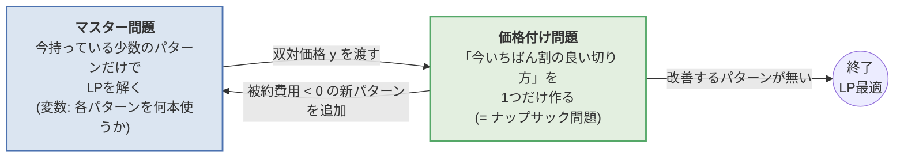
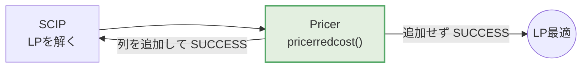
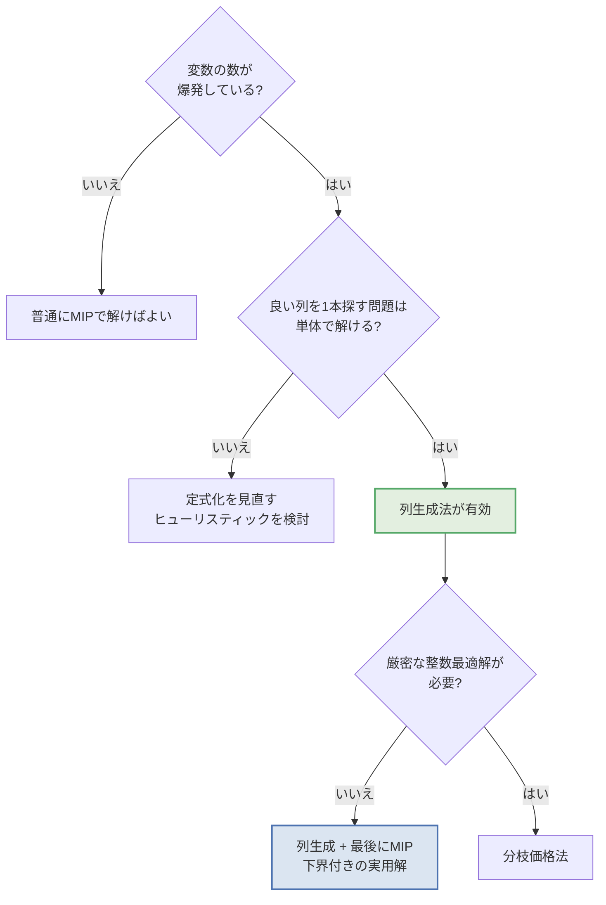

## この記事について

「線形計画・混合整数計画は知っている。定式化してソルバーに投げたこともある。
という実務者向けに、**列生成法(Column Generation)** を図中心で説明します。
扱う題材は、製紙・鉄鋼・フィルム・スリッター工程などで実際に出てくる
**原反(ロール)の切り出し問題(カッティングストック問題)** です。

:::message
この記事のコードはすべて手元で実行して結果を確認しています。
ソルバーはこのシリーズの標準環境である **PySCIPOpt(SCIP)** に統一しています。

| | バージョン |
| ---- | ---- |
| Python | 3.14 |
| PySCIPOpt | 6.2.1 |
| SCIP | 10.0 |
:::

## 題材: 3000mm の原反から、注文幅を切り出す

工場には幅 3000mm の原反(ロール)があります。
お客さんからは「この幅で、この本数ほしい」という注文が来ます。


| 品種 | 幅 | 必要本数 |
| ---- | ---- | ---- |
| A | 1380mm | 40 |
| B | 1120mm | 90 |
| C | 940mm | 120 |
| D | 760mm | 60 |
| E | 610mm | 110 |
| F | 430mm | 150 |

やりたいことは単純で、**使う原反の本数を最小にしたい**。
原反1本あたりの単価は同じなので、これは「端材(ロス)を減らす = 歩留まりを上げる」ことと同じです。

現場ではこれを「歩留まり99%を目指す」みたいな言い方をします。
1%が数千万円になる業界なので、これは立派な金額の話です。

## まずは素直に定式化してみる

この問題を素直にモデル化すると、意思決定変数は何になるでしょうか。

「原反1本ごとに、どの幅を何本切るか」を変数にすると、
原反の本数(150本前後)×品種数 の整数変数になり、しかも**同じ解が並び替えただけで大量に重複します**(対称性)。
これはソルバーが非常に苦手とする形で、規模が大きくなるとまず解けません。

そこで実務では、**「切り方(パターン)」を単位に考えます**。

> パターン = 原反1本をどう切り分けるかの組み合わせ
> 例:「1380mm を1本 + 760mm を1本 + 430mm を2本 (ロス 0mm)」

パターンを全部並べて、「そのパターンで何本切るか」を変数にすると、非常に素直なモデルになります。

$$
\begin{aligned}
\min_{x} \quad & \sum_{p \in P} x_p & & \text{(使う原反の本数)}\\
\text{s.t.} \quad & \sum_{p \in P} a_{ip}\, x_p \ge d_i & & \forall i \text{(品種 } i \text{ の必要本数を満たす)}\\
& x_p \ge 0
\end{aligned}
$$

- $P$: すべての切り方(パターン)の集合
- $a_{ip}$: パターン $p$ の中に品種 $i$ が何本含まれるか
- $d_i$: 品種 $i$ の必要本数
- $x_p$: パターン $p$ を何本使うか

制約は品種の数(ここでは6本)しかなく、非常にきれいなモデルです。

### ところが $P$ が爆発する

問題は $P$ の大きさです。パターンの総数は品種数に対して指数的に増えます。


今回の6品種なら全部で **50通り** しかないので、全列挙してソルバーに渡せば終わりです。
しかし品種が40種類になると **約49万通り**。実務の受注は数十〜数百品種あり、
原反幅や最小切り幅の条件次第で、パターン数は簡単に億を超えます。

- 全列挙するとメモリに乗らない
- 乗ったとしてもLPを1回解くのに時間がかかりすぎる

「モデルはきれいなのに、変数を全部書き出せない」という状態です。
ここで登場するのが列生成法です。

## 列生成法のアイデア: 全部作らず、必要になったものだけ作る

列生成法の主張はとてもシンプルです。

> **49万通りのパターンを全部用意しても、最終的に使うのはせいぜい数十通りである。**
> だったら、最初から全部用意するのはやめて、
> **「今の解を改善してくれるパターン」だけを、必要になった時点で作ればいい。**

料理でいえば、「あり得る全メニューを事前に仕込む」のではなく、
「今日の売れ行きを見て、足りないものだけ追加で作る」という発想です。

そのために、問題を2つに分けます。



- **マスター問題(RMP: 制限付きマスター問題)**
  手持ちのパターンだけを列(変数)に持つLP。小さいのですぐ解ける。
- **価格付け問題(Pricing / 部分問題)**
  「マスター問題に追加すると解が良くなる列はどれか」を探す問題。
  パターンを列挙するのではなく、**最適化で1本作る**のがポイント。

この2つを行ったり来たりして、「もう改善する列は存在しない」と分かった時点で、
**全パターンを列挙したときのLP最適解と同じ答え**が得られます。
ここが列生成法の一番おいしいところで、
「一部の列しか見ていないのに、全部見たのと同じ結論が言える」という保証があります。

## ステップ1: 適当な初期パターンから始める

まずは何でもいいので、実行可能な初期パターンを用意します。
定番は「1品種だけを詰め込むパターン」です。


これだけで注文はすべて満たせますが、見てのとおり**ロスだらけ**で、合計 **178本** 必要です。
歩留まりは 83.5%。現場に出したら怒られる数字です。

## ステップ2: 双対価格を「社内の値付け」として読む

マスター問題(LP)を解くと、各制約(= 各品種の必要本数)に対して **双対価格 $y_i$** が得られます。

数学的な定義は「制約を1単位緩めたときの目的関数の改善量」ですが、
この問題では次のように読むと分かりやすいです。

> $y_i$ = **品種 $i$ を1本作るために、原反を何本ぶん消費した扱いにするか**
> つまり「社内の卸値」「原反の消費コスト換算」


初回の反復では、初期パターンがロスだらけなので値付けもいい加減です
(例: 1380mm は原反1本から2本しか取れないので $y=0.5$、つまり原反0.5本ぶんの扱い)。

反復が進むと、値付けは「幅 ÷ 3000(面積比)」にどんどん近づいていきます。
**ロスなく切れているなら、コストは幅に比例するはず**だからです。
逆に、この値からズレている品種は「まだうまく切れていない品種」ということになります。

## ステップ3: 価格付け問題はナップサック問題になる

ここが列生成法の心臓部です。

新しいパターン $a = (a_1, \dots, a_n)$ をマスター問題に追加したとき、
そのパターンが解を改善するかどうかは **被約費用(reduced cost)** で判定できます。

$$
\bar{c} = \underbrace{1}_{\text{原反1本のコスト}} - \sum_{i} y_i a_i
$$

$\bar{c} < 0$、つまり **$\sum_i y_i a_i > 1$** なら、そのパターンは追加する価値があります。
言い換えると、

> **原反1本(コスト1)を使って、社内価値の合計が1を超える切り方ができるなら、それは得**

これは「価値 $y_i$ / 重さ $w_i$ のアイテムを、容量3000mm の袋に詰めて価値最大化」、
すなわち**整数ナップサック問題**そのものです。

$$
\max_{a \ge 0,\ \text{整数}} \sum_i y_i a_i \quad \text{s.t.} \quad \sum_i w_i a_i \le 3000
$$


49万通りを列挙する代わりに、**小さなナップサック問題を1回解くだけ**で
「今いちばん役に立つ列」を1本だけ取り出せる。これが列生成法の効きどころです。

:::message
ナップサック問題自体はNP困難ですが、幅の種類が数十、容量が数千程度ならDPやMIPで一瞬で解けます。
「指数個の列挙」が「小さな最適化問題1回」に化けたのがポイントです。
:::

## ステップ4: 実装する

全部つなげると、こうなります。ソルバーは SCIP(PySCIPOpt)を使います。
環境構築はこちらです。

@[card](https://zenn.dev/ctenopoma/articles/mixintegerprogramming_study_2)

```bash
pip install pyscipopt
```

### 先に注意: 双対価格の取り出し

列生成では**マスター問題の双対価格が命**です。
ところが SCIP は「整数計画ソルバー」なので、**何も設定しないと双対価格が取れません**。
前処理(presolve)が問題を変形してしまい、元の制約に対応する双対値が失われるためです。

同じLPを設定を変えて解き、双対価格がどうなるか比べてみました。

| 設定 | 変数 | `getDualSolVal()` の結果 |
| ---- | ---- | ---- |
| presolve等をOFF | 連続 | `[0.5, 0.5, 0.333, 0.333, 0.25, 0.167]` ← 正しい |
| デフォルト | 連続 | `[0, 0, 0, 0, 0, 0]` ← **全部0になる** |
| presolve等をOFF | 整数 | `[0.5, 0.5, 0.333, 0.333, 0.0, 0.167]` ← **意味のない値** |

したがって、マスター問題は次の2点を守る必要があります。

1. **変数は必ず連続(`vtype="C"`)にする** — 整数計画に双対価格は存在しません
2. **presolve / heuristics / propagation を切る**

:::message alert
筆者の環境(PySCIPOpt 6.2.1)では `getDualsolLinear()` は 0 を返しました。
モデルを直接解いて双対価格を取りたい場合は **`getDualSolVal()`** を使ってください。
(後述の Pricer プラグインの中では `getDualsolLinear()` が正しく動きます)
:::

### 実装

```python
from pyscipopt import Model, quicksum, SCIP_PARAMSETTING

W = 3000  # 原反幅[mm]
ORDERS = [("A", 1380, 40), ("B", 1120, 90), ("C", 940, 120),
          ("D", 760, 60), ("E", 610, 110), ("F", 430, 150)]
WIDTHS = [w for _, w, _ in ORDERS]
DEMANDS = [d for _, _, d in ORDERS]
N = len(ORDERS)


def solve_master(patterns, integer=False):
    """マスター問題: 手持ちパターンだけで「何本ずつ使うか」を決める。

    integer=False のときは LP として解き、双対価格も返す。
    """
    m = Model("master")
    m.hideOutput()
    if not integer:
        # 双対価格を正しく取り出すためのおまじない
        m.setPresolve(SCIP_PARAMSETTING.OFF)
        m.setHeuristics(SCIP_PARAMSETTING.OFF)
        m.disablePropagation()

    vtype = "I" if integer else "C"
    x = [m.addVar(vtype=vtype, lb=0, obj=1.0, name=f"x{j}") for j in range(len(patterns))]
    m.setMinimize()  # 使う原反の本数を最小化

    cons = []
    for i in range(N):
        c = m.addCons(
            quicksum(patterns[j][i] * x[j] for j in range(len(patterns))) >= DEMANDS[i],
            name=f"demand_{i}")
        cons.append(c)

    m.optimize()
    # LPのときだけ双対価格が取れる(整数計画では取れない)
    duals = None if integer else [m.getDualSolVal(c) for c in cons]
    return m.getObjVal(), [m.getVal(v) for v in x], duals


def solve_pricing(duals):
    """価格付け問題: 双対価格を「価値」とみなした整数ナップサック問題"""
    m = Model("pricing")
    m.hideOutput()
    a = [m.addVar(vtype="I", lb=0, obj=duals[i], name=f"a{i}") for i in range(N)]
    m.setMaximize()                                                 # 価値の合計を最大化
    m.addCons(quicksum(WIDTHS[i] * a[i] for i in range(N)) <= W)    # 原反幅に収める
    m.optimize()
    return m.getObjVal(), [int(round(m.getVal(v))) for v in a]


# 初期パターン: 1品種だけを詰め込む
patterns = [[W // WIDTHS[i] if i == j else 0 for i in range(N)] for j in range(N)]

# --- 列生成のループ ---
for it in range(1, 100):
    obj, xs, duals = solve_master(patterns)      # マスター問題を解いて双対価格を得る
    val, new_pattern = solve_pricing(duals)      # 一番おいしい切り方を1つ作る
    reduced_cost = 1 - val
    print(f"[{it}] LP={obj:.3f} 被約費用={reduced_cost:+.4f} 新パターン={new_pattern}")

    if reduced_cost > -1e-6:                     # もう改善する列は存在しない
        print("  -> LP最適に到達")
        break
    patterns.append(new_pattern)                 # 列を1本追加してやり直し

# 最後に、生成された列だけを使って整数計画として解く
lp_obj, _, _ = solve_master(patterns)
ip_obj, ip_x, _ = solve_master(patterns, integer=True)
print(f"LP下界={lp_obj:.3f} / 整数解={ip_obj:.0f} / 生成した列={len(patterns)}")
for p, v in zip(patterns, ip_x):
    if v > 0.5:
        loss = W - sum(WIDTHS[i] * p[i] for i in range(N))
        print(f"  {p} x {v:.0f}  ロス{loss}mm")
```

`solve_master()` と `solve_pricing()` はどちらも十数行しかありません。
列生成法の実装そのものは、この2つを交互に呼ぶだけです。

### 実行結果

```txt
[1] LP=177.500 被約費用=-0.3333 新パターン=[0, 2, 0, 1, 0, 0]
[2] LP=162.500 被約費用=-0.2500 新パターン=[0, 0, 0, 3, 1, 0]
[3] LP=161.250 被約費用=-0.1667 新パターン=[0, 0, 0, 0, 4, 1]
[4] LP=156.875 被約費用=-0.0972 新パターン=[0, 0, 0, 1, 0, 5]
[5] LP=155.417 被約費用=-0.0833 新パターン=[0, 1, 0, 0, 0, 4]
[6] LP=154.808 被約費用=-0.0513 新パターン=[0, 1, 2, 0, 0, 0]
[7] LP=152.377 被約費用=-0.0574 新パターン=[1, 0, 0, 1, 0, 2]
[8] LP=150.192 被約費用=-0.0385 新パターン=[0, 0, 0, 0, 2, 4]
[9] LP=149.881 被約費用=-0.0238 新パターン=[0, 0, 0, 2, 1, 2]
[10] LP=149.821 被約費用=-0.0179 新パターン=[0, 1, 0, 0, 3, 0]
[11] LP=149.375 被約費用=+0.0000 新パターン=[0, 0, 0, 0, 2, 4]
  -> LP最適に到達
LP下界=149.375 / 整数解=150 / 生成した列=16
  [0, 2, 0, 1, 0, 0] x 3  ロス0mm
  [0, 1, 2, 0, 0, 0] x 60  ロス0mm
  [1, 0, 0, 1, 0, 2] x 40  ロス0mm
  [0, 0, 0, 0, 2, 4] x 13  ロス60mm
  [0, 0, 0, 2, 1, 2] x 9  ロス10mm
  [0, 1, 0, 0, 3, 0] x 25  ロス50mm
```


11回の反復で終了しました。追加した列は10本だけです。

- 序盤の列は効果が大きく(1本足すだけで15本分の改善)、終盤になるほど効果が小さくなる
- 被約費用が0になった時点で「もう改善する列は存在しない」ことが**証明**されて終了

得られた解がこちらです。


| | 使用本数 | 歩留まり |
| ---- | ---- | ---- |
| 初期パターン(1品種詰め)のみ | 178本 | 83.5% |
| **列生成 + 整数化** | **150本** | **99.1%** |

同じ注文を、原反28本(約16%)少なく作れることになりました。

## SCIPの Pricer プラグインに列生成を任せる

上のコードは反復のたびにマスター問題をゼロから作り直しています。分かりやすい代わりに、
問題が大きくなるとここがボトルネックになります(毎回LPを一から解き直すため)。

SCIP には **Pricer** というプラグインの仕組みがあり、
「LPを解いた後に呼ばれて、必要なら列を追加する」処理を登録できます。
こうすると SCIP が**ウォームスタートしながら**列生成を回してくれます。



```python
from pyscipopt import Model, Pricer, SCIP_RESULT, SCIP_PARAMSETTING, quicksum

W = 3000
ORDERS = [("A", 1380, 40), ("B", 1120, 90), ("C", 940, 120),
          ("D", 760, 60), ("E", 610, 110), ("F", 430, 150)]
WIDTHS = [w for _, w, _ in ORDERS]
DEMANDS = [d for _, _, d in ORDERS]
N = len(ORDERS)


class PatternPricer(Pricer):
    """LPを解くたびにSCIPから呼ばれ、被約費用が負のパターンを1本追加する。"""

    def pricerredcost(self):
        cons = self.data["cons"]
        duals = [self.model.getDualsolLinear(c) for c in cons]

        # 価格付け問題(ナップサック)を別モデルとして解く
        sub = Model("pricing")
        sub.hideOutput()
        a = [sub.addVar(vtype="I", lb=0, obj=duals[i]) for i in range(N)]
        sub.setMaximize()
        sub.addCons(quicksum(WIDTHS[i] * a[i] for i in range(N)) <= W)
        sub.optimize()

        reduced_cost = 1 - sub.getObjVal()
        pattern = [int(round(sub.getVal(v))) for v in a]
        if reduced_cost < -1e-6 and pattern not in self.data["patterns"]:
            # マスター問題に列(変数)を1本追加する
            newvar = self.model.addVar(f"x{len(self.data['patterns'])}",
                                       vtype="C", lb=0, obj=1.0, pricedVar=True)
            for c, coef in zip(cons, pattern):
                self.model.addConsCoeff(c, newvar, coef)   # 既存制約に係数を差し込む
            self.data["patterns"].append(pattern)
            print(f"  + 新パターン {pattern} (被約費用 {reduced_cost:+.4f})")
        return {"result": SCIP_RESULT.SUCCESS}

    def pricerinit(self):
        # 元の制約を「変換後の制約」に差し替える(双対価格はこちらから取る)
        self.data["cons"] = [self.model.getTransformedCons(c) for c in self.data["cons"]]


m = Model("cutting-stock")
m.setPresolve(SCIP_PARAMSETTING.OFF)
m.setIntParam("presolving/maxrestarts", 0)
m.setParam("misc/allowstrongdualreds", 0)
m.hideOutput()

patterns = [[W // WIDTHS[i] if i == j else 0 for i in range(N)] for j in range(N)]
x = [m.addVar(vtype="C", lb=0, obj=1.0, name=f"x{j}") for j in range(N)]
m.setMinimize()

cons = []
for i in range(N):
    c = m.addCons(
        quicksum(patterns[j][i] * x[j] for j in range(N)) >= DEMANDS[i],
        name=f"demand_{i}",
        separate=False, modifiable=True)   # modifiable=True が「列が増える」宣言
    cons.append(c)

pricer = PatternPricer()
m.includePricer(pricer, "PatternPricer", "原反の切り方を必要に応じて生成する")
pricer.data = {"cons": cons, "patterns": patterns}

m.optimize()
print(f"LP最適値 = {m.getObjVal():.3f} 本 / 生成された列 = {len(pricer.data['patterns'])}")
```

```txt
  + 新パターン [0, 2, 0, 1, 0, 0] (被約費用 -0.3333)
  + 新パターン [0, 0, 0, 3, 1, 0] (被約費用 -0.2500)
  + 新パターン [0, 0, 0, 0, 4, 1] (被約費用 -0.1667)
  + 新パターン [0, 0, 0, 1, 0, 5] (被約費用 -0.0972)
  + 新パターン [0, 1, 0, 0, 0, 4] (被約費用 -0.0833)
  + 新パターン [0, 1, 2, 0, 0, 0] (被約費用 -0.0513)
  + 新パターン [1, 0, 0, 1, 0, 2] (被約費用 -0.0574)
  + 新パターン [0, 0, 0, 0, 2, 4] (被約費用 -0.0385)
  + 新パターン [0, 0, 0, 2, 1, 2] (被約費用 -0.0238)
  + 新パターン [0, 1, 0, 0, 3, 0] (被約費用 -0.0179)
LP最適値 = 149.375 本 / 生成された列 = 16
```

手書きループと同じ列・同じ値に到達しました。実装のポイントは3つです。

- 制約を **`modifiable=True`** で作る(「あとから列が増える」ことをSCIPに伝える)
- 追加する変数は **`pricedVar=True`**、係数は `addConsCoeff()` で既存制約に差し込む
- `pricerinit()` で制約を `getTransformedCons()` に差し替える

### ここで踏んではいけない地雷

上のコードでマスター変数を `vtype="I"`(整数)にすると、
SCIPが分枝限定法を始めます。すると次のことが起きます。

> SCIPが「パターン7を3本以下にする」と分枝する
> → 価格付け問題はその制限を知らないので、また同じパターン7を作ってくる
> → 追加 → 分枝 → また同じ列 → **無限ループ**

実際に試すと、`[0, 2, 0, 1, 0, 0]` と `[0, 1, 2, 0, 0, 0]` を延々と生成し続けて終わりませんでした。

これは実装ミスではなく、**列生成と分枝限定法を組み合わせるときの本質的な難しさ**です。
「分枝の情報を価格付け問題にどう伝えるか」を設計して初めて、
両者を正しく組み合わせられます。それが次回扱う **分枝価格法(Branch-and-Price)** です。

そのため、この記事の範囲では
「マスター問題はLPとして解き、最後に生成された列だけで整数計画を解き直す」という
実務的な折衷を採っています。

## LP緩和と整数解のあいだ

ここで一つ、実務上とても大事な話をします。

**列生成法が最適性を保証してくれるのは LP緩和 に対してだけ**です。
上の例では LP の最適値が 149.375 本でしたが、原反を0.375本使うことはできません。

ただし今回は運が良く、

- LP最適値 149.375 は**すべてのパターンを考慮した上での下界**(価格付けで「もう良い列は無い」と証明済み)
- 整数なので、本当の最適値は $\lceil 149.375 \rceil = 150$ 本以上
- 実際に150本の整数解が見つかった

したがって **150本が真の最適解**だと言い切れます。

いつもこう上手くいくわけではありません。LP下界と整数解のあいだにギャップが残る場合は、

1. **LP解を丸めて、足りない分を追加で作る**(実務ではこれで十分なことも多い)
2. **生成された列だけで整数計画を解く**(今回やった方法。ヒューリスティックだが強力)
3. **分枝価格法(Branch-and-Price)** — 分枝限定法の各ノードで列生成を回す厳密解法

という順に手が重くなっていきます。
特に2の「列生成でいい感じの列を集めて、最後にMIPで解く」は、
実装コストと効果のバランスが良く、現場でよく使われます。

:::message alert
2の方法で得られた解は「生成された列の範囲での最適解」であって、全体の最適解とは限りません。
ただし LP下界が同時に手に入るので、**「最適値との差は最大で何%か」を常に言える**のが強みです。
上の例なら $(150 - 149.375)/149.375 = 0.4\%$ 以内、と報告できます。
:::

## 実務で使うときの勘所

### 現場制約は「価格付け問題」に押し込める

実務のカッティングストックには、こんな制約がついて回ります。

- ナイフの本数上限(1本の原反から切れる本数は最大◯本まで)
- 最小・最大の端材幅(端材が細すぎると巻き取れない)
- 同時に使える品種の組み合わせ制限、刃の位置の制約

これらは**すべて価格付け問題(ナップサック)側の制約として追加できます**。
マスター問題は「パターンを何本使うか」のままで、モデル構造は一切変わりません。

「現場制約を足したらモデルが破綻する」ということが起きにくいのは、
列生成法の設計上の大きな利点です。

### 段取り替え(パターン切替)コスト

「使うパターンの種類を減らしたい」という要求は非常によくあります。
刃の位置を変える段取り替えに時間がかかるからです。

この場合、パターンを使うかどうかの0-1変数 $z_p$ を入れて
$x_p \le M z_p$、$\sum_p z_p \le K$ とするのが素直ですが、
これはLPの双対を素直に扱えなくなるため、分枝価格法や、
「列生成で候補を集めてから最後にMIPで種類数を絞る」といった実務的な折衷が使われます。

### 退化と振動(ここでハマる)

列生成は理論はきれいですが、実装すると次の問題によく当たります。

- **退化(degeneracy)**: 双対価格が反復ごとに大きく暴れて、なかなか収束しない
- **テーリングオフ(tailing-off)**: 最後の1%を詰めるのに反復回数が異常にかかる

上のグラフでも、後半は改善幅がどんどん小さくなっているのが見えます。
対策としては、

- 1反復で1列ではなく、**上位k列をまとめて追加する**
- 双対価格の変動を抑える **安定化列生成(dual stabilization)**
- 価格付けを厳密に解かず、**負の被約費用の列が見つかった時点で打ち切る**(ヒューリスティック価格付け)
- **打ち切り条件を緩める**(被約費用が -0.01 を下回らなくなったら終了、など)

実務では最後の「そこそこで止める」が一番効きます。
LP下界は反復ごとに手に入るので、精度の保証は付けたまま止められます。

### マスター問題は解き直さない

本気で実装するなら、「マスター問題を毎回作り直す」のではなく
「列を追加して**ウォームスタート**する」のが定石です。
列生成の時間の大半はマスター問題のLPに消えるので、ここが一番効きます。

上で紹介した SCIP の Pricer プラグインを使えば、この部分はソルバー任せにできます。
自前でループを書く場合も、双対単体法でウォームスタートできるAPIがあるソルバーを選ぶとよいです。

## カッティングストック以外の応用

列生成法は「変数(列)が指数的に多いが、良い列を1本作る問題は簡単」という構造があれば使えます。
企業の実問題では、以下がその代表格です。

| 問題 | 1つの列(パターン)が意味するもの | 価格付け問題 |
| ---- | ---- | ---- |
| カッティングストック | 原反1本の切り方 | ナップサック問題 |
| 乗務員・シフト作成 | 1人分の1週間の勤務パターン | 制約付き最短路問題 |
| 配送計画(VRP) | 1台のトラックの1ルート | 資源制約付き最短路問題 |
| ビンパッキング | 1つの箱の詰め方 | ナップサック問題 |
| 生産ロット計画 | 1ラインの生産スケジュール | 動的計画法 |

たとえばシフト作成では、「連続勤務は5日まで」「夜勤の翌日は休み」といった
**個人単位の複雑なルールは全部、列(=1人分の勤務パターン)を作る側に押し込めます**。
マスター問題は「各時間帯に必要な人数を満たすようパターンを選ぶ」というシンプルな集合被覆問題になり、
現場のルールが増えてもモデルの骨格が崩れません。

この「複雑なルールを部分問題に隔離できる」性質こそが、
実務で列生成法が選ばれる最大の理由だと思っています。



## まとめ

- 「パターンを変数にする」定式化はきれいだが、パターン数が指数的に爆発する
- 列生成法は、**全パターンを列挙せず、必要な列だけを都度作る**
- マスター問題(小さいLP)と価格付け問題(ナップサックなど)を往復する
- 双対価格は「その品種を1本作る社内価格」と読むと直感的
- 被約費用が負の列が無くなったら、**全列挙したのと同じLP最適解**に到達している
- 得られるのはLP解なので、整数解にするには丸め・MIP・分枝価格法のいずれかが必要
- 現場制約は価格付け問題に押し込めるため、モデルが壊れにくい
- SCIPで解くなら、マスター問題は連続変数 + presolve類OFF。Pricerプラグインを使うとウォームスタートまで任せられる
- ただし**素朴に整数変数にすると、価格付けが同じ列を作り続けて止まらない**

この最後の点を正しく解決するのが、次回扱う **分枝価格法(Branch-and-Price)** です。

@[card](https://zenn.dev/ctenopoma/articles/branch-and-price)

## 参考

@[card](https://scmopt.github.io/opt100/)
@[card](https://pyscipopt.readthedocs.io/en/latest/)

- Gilmore, P. C., & Gomory, R. E. (1961). *A Linear Programming Approach to the Cutting-Stock Problem.* Operations Research. — 列生成法の原典で、まさにこのカッティングストック問題が題材です。
