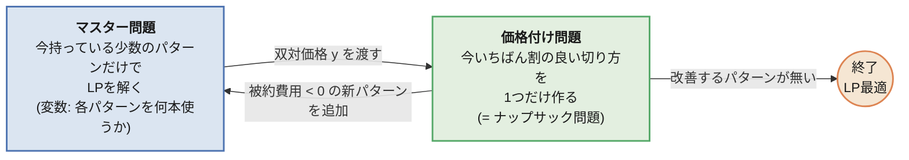
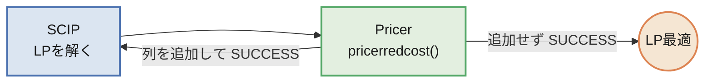
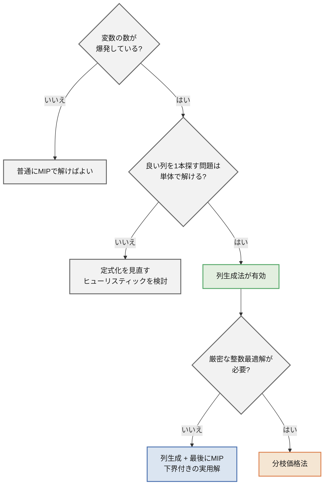

## この記事について

線形計画・混合整数計画は知っていて、定式化してソルバーに投げたこともある。
そういう人向けに、**列生成法(Column Generation)** を説明します。

題材は、製紙・鉄鋼・フィルムのスリッター工程で出てくる
**原反(ロール)の切り出し問題(カッティングストック問題)** です。

この記事で実際に測った数字を先に出しておきます。

| | 結果 |
| ---- | ---- |
| 素直な定式化をSCIPに投げる | 120秒でギャップ6.3%を残して時間切れ |
| 列生成 + 最後にMIP | **0.11秒**で最適解、しかも最適性の証明つき |

たった6品種の問題です。この差がどこから来るのかが本題です。

:::message
コードはすべて手元で実行し、記事中の数値は実行結果をそのまま貼っています。
ソルバーはこのシリーズの標準環境である **PySCIPOpt(SCIP)** に統一しています。

| | バージョン |
| ---- | ---- |
| Python | 3.14 |
| PySCIPOpt | 6.2.1 |
| SCIP | 10.0 |
:::

## 題材: 3000mm の原反から、注文幅を切り出す

工場には幅 3000mm の原反(ロール)があります。
お客さんからは「この幅で、この本数ほしい」という注文が来ます。


| 品種 | 幅 | 必要本数 |
| ---- | ---- | ---- |
| A | 1380mm | 40 |
| B | 1120mm | 90 |
| C | 940mm | 120 |
| D | 760mm | 60 |
| E | 610mm | 110 |
| F | 430mm | 150 |

やりたいことは単純で、**使う原反の本数を最小にしたい**。
原反1本あたりの単価は同じなので、これは「端材(ロス)を減らす = 歩留まりを上げる」ことと同じです。

注文の総幅は 446,000mm。原反1本が 3000mm なので、
ロスがゼロなら $446000 / 3000 = 148.7$、つまり **149本**が理論的な下限です。
以下の話は、この 149 にどこまで近づけるかという話になります。

## まず、素直な定式化がどうなるかを見る

意思決定変数を素直に取ると、「$k$ 本目の原反から、品種 $i$ を何本切るか」になります。
原反の使用本数に上限 $K$ を決め打ちして書くと、こうなります。

$$
\begin{aligned}
\min_{z, u} \quad & \sum_{k=1}^{K} u_k & & \text{(使った原反の本数)}\\
\text{s.t.} \quad & \sum_{i} w_i\, z_{ki} \le W u_k & & \forall k \text{(原反 } k \text{ の幅に収める)}\\
& \sum_{k} z_{ki} \ge d_i & & \forall i \text{(品種 } i \text{ の必要本数を満たす)}\\
& z_{ki} \in \mathbb{Z}_{\ge 0},\quad u_k \in \{0, 1\}
\end{aligned}
$$

- $W = 3000$: 原反の幅
- $w_i, d_i$: 品種 $i$ の幅と必要本数
- $z_{ki}$: **$k$ 本目の原反から品種 $i$ を何本切るか**
- $u_k$: $k$ 本目の原反を使うかどうか

$K$ は「これだけあれば絶対足りる」という本数にします。
後で出てくる素朴な解が178本なので、$K = 178$ で十分です。

このとき変数の数は、

- 整数変数 $z_{ki}$: $K \times N = 178 \times 6 = \mathbf{1068}$ 本
- 0-1変数 $u_k$: $\mathbf{178}$ 本

になります。品種が6つしかないのに、変数が1200本を超えました。
「原反の本数 × 品種数」というのはこの掛け算のことです。

### 数が多いこと自体より、対称性が効く

変数が1200本というだけなら、MIPソルバーにとっては大した規模ではありません。
本当に効くのは、**同じ内容の解が大量に重複している**ことです。


原反には $k = 1, 2, \dots, 178$ と番号がついていますが、工場から見れば原反に個体差はありません。
上の図の2つは、モデルの上では $z$ の値が違う別々の解ですが、工場にとっては同じ切り方です。
178本の並べ替えを考えれば、**同じ内容の解が天文学的な数だけモデル上に存在します**。

分枝限定法はこれが苦手です。
「原反#1をこう使うのはやめよう」という枝を切っても、
まったく同じ内容の解が「原反#2として」「原反#3として」生き残るので、下界がなかなか上がりません。

### 実際に投げてみる

上の定式化をそのまま SCIP に渡し、120秒の制限時間で解かせました。

| | |
| ---- | ---- |
| 整数変数 / 0-1変数 / 制約 | 1068 / 178 / 184 |
| 探索したノード数 | 7,673 |
| 120秒後の暫定解 | **158本** |
| 120秒後の下界 | 148.67本 |
| 残ったギャップ | **6.3%** |

6品種の問題で、120秒かけて「150本」にすら届いていません。
品種が増えれば $K$ も増えるので、変数の数は掛け算で効いていきます。

素直な定式化は、**書けるが解けない**。ここが出発点です。

## 定式化を変える: 「切り方」を変数にする

実務では、意思決定の単位を「原反1本ごと」ではなく「**切り方(パターン)**」に変えます。

> パターン = 原反1本をどう切り分けるかの組み合わせ
> 例:「1380mm を1本 + 760mm を1本 + 430mm を2本 (ロス 0mm)」

そして「そのパターンで**何本**切るか」を変数にします。
原反に番号がなくなるので、さきほどの対称性が消えます。

$$
\begin{aligned}
\min_{x} \quad & \sum_{p \in P} x_p & & \text{(使う原反の本数)}\\
\text{s.t.} \quad & \sum_{p \in P} a_{ip}\, x_p \ge d_i & & \forall i \text{(品種 } i \text{ の必要本数を満たす)}\\
& x_p \ge 0
\end{aligned}
$$

- $P$: すべての切り方(パターン)の集合
- $a_{ip}$: パターン $p$ の中に品種 $i$ が何本含まれるか
- $x_p$: パターン $p$ を何本使うか

制約は品種の数(ここでは6本)だけになりました。

:::message
**$x_p$ が整数でないことについて**

本当は「パターン $p$ を 2.5 本使う」はあり得ないので $x_p$ は整数であるべきです。
ここで整数条件をわざと外したものを **LP緩和**と呼びます。

なぜ外すかというと、このあと使う **双対価格が線形計画(LP)にしか存在しない**からです。
整数条件を外した分だけ答えは甘くなりますが、その代わり
「元の整数問題の最適値は、絶対にこの値以上」という**下界**が手に入ります。
記事の後半で、この下界がそのまま実務の武器になります。
:::

### $P$ が爆発する

問題は $P$ の大きさです。パターンの総数は品種数に対して指数的に増えます。


グラフは「原反幅3000mm、指定したレンジに品種の幅を等間隔に並べたとき、
これ以上詰められない切り方が何通りあるか」を数えたものです。

- 今回の6品種なら **50通り**。全部並べてMIPに渡せば終わりです
- 品種が40に増えると、幅レンジが 430〜1380mm なら **26,965通り**
- 同じ40品種でも、200mm の細幅が混じるだけで **419,189通り**

実務の受注は数十〜数百品種あり、幅のレンジも広いので、
パターン数が億に届くのは珍しくありません。そうなると、

- 全列挙するとメモリに乗らない
- 乗ったとしてもLPを1回解くのに時間がかかりすぎる

「定式化はきれいなのに、変数を全部書き出せない」という状態です。

## 列生成法: 全部作らず、必要になったものだけ作る

ここで手がかりになるのは、**最後に使われる列はごく少ない**という事実です。

この記事の問題で先に答えを言うと、切り方は全部で50通りありますが、
このあと実際に作ることになるのは **10通り**、
そのうち最終的なLP最適解が値をつけたのは **6通り**だけです。
残り40通りは、一度もモデルに現れません。

これは偶然ではありません。LPの基底解の性質から、
**最適解で値がつく変数の数は、多くても制約の本数(=品種数)まで**と決まっています。
つまり列が50本あろうと42万本あろうと、値がつくのは高々6本です。

だったら、最初から全部用意するのはやめて、
**「今の解を改善してくれる列」だけを、必要になった時点で作ればいい**。
これが列生成法です。

そのために、問題を2つに分けます。



- **マスター問題(RMP: 制限付きマスター問題)**
  手持ちのパターンだけを列(変数)に持つLP。小さいのですぐ解けます。
- **価格付け問題(Pricing / 部分問題)**
  「マスター問題に追加すると解が良くなる列はどれか」を探す問題。
  パターンを列挙するのではなく、**最適化で1本作る**のがポイントです。

この図の1周を、以下では **1反復(イテレーション)** と呼びます。

> **1反復 =**
> 1. 手持ちの列だけでマスター問題(LP)を解く
> 2. そこから双対価格 $y$ を取り出す
> 3. $y$ を使って価格付け問題を解き、列を1本作る
> 4. その列が解を改善するなら手持ちに加え、1に戻る

**列は毎回1本ずつ増え、マスター問題は毎回解き直します**。
そのため反復が進むとマスター問題のLP値は下がっていきます
(列 = 選択肢が増えるので、解が悪くなることはありません)。

この2つを往復して「もう改善する列は存在しない」と分かった時点で、
**全パターンを列挙したときのLP最適解と同じ答え**が得られます。
一部の列しか見ていないのに、全部見たのと同じ結論が言える。これが列生成法の主張です。

なぜそう言い切れるのかは、次の双対価格の話で決まります。

## ステップ1: 適当な初期パターンから始める

まずは何でもいいので、実行可能な初期パターンを用意します。
定番は「1品種だけを詰め込むパターン」です。


これだけで注文はすべて満たせますが、見てのとおりロスだらけで、合計 **178本** 必要です。
歩留まりは 83.5%。理論下限の149本には遠く及びません。

## ステップ2: 双対価格 $y$ を定式化する

ここが記事の要です。曖昧にせず、双対問題を書き下します。

マスター問題(LP)は次の形でした。

$$
\begin{aligned}
\min_{x \ge 0} \quad & \sum_{p \in P} x_p \\
\text{s.t.} \quad & \sum_{p \in P} a_{ip}\, x_p \ge d_i \quad \forall i
\end{aligned}
$$

各制約(品種 $i$ の必要本数)に双対変数 $y_i \ge 0$ を対応させると、双対問題はこうなります。

$$
\begin{aligned}
\max_{y \ge 0} \quad & \sum_{i} d_i\, y_i \\
\text{s.t.} \quad & \sum_{i} a_{ip}\, y_i \le 1 \quad \forall p \in P
\end{aligned}
$$

ここに列生成のすべてが入っています。

- 主問題の**列** $p$ が、双対問題では**制約** $\sum_i a_{ip} y_i \le 1$ に対応する
- 主問題で列を全部持てない = 双対問題で制約を全部持てない
- **列を追加する = 双対問題で「今の $y$ が破っている制約」を1本見つけて追加する**

つまり列生成は、双対側から見れば**切除平面法**です。
「破られている制約が1本も無い」と確認できた時点で、
今の $y$ は $P$ 全体に対して実行可能になり、**双対定理から主問題も最適**だと言えます。
これが「一部しか見ていないのに全部見たのと同じ」の中身です。

### $y_i$ は何を表す数か

双対変数の一般的な意味は「制約の右辺を1単位緩めたときの目的関数の変化量」です。
この問題に当てはめると、

> $y_i$ = **品種 $i$ の注文を1本増やしたとき、必要な原反が何本増えるか**

になります。単位は「原反の本数 / 品種 $i$ 1本」です。

言葉だけだと怪しいので、実際に確かめました。
収束後のLPで、品種ごとに需要 $d_i$ を1本だけ増やして解き直した結果です。

| 品種 | 双対価格 $y_i$ | 需要を+1したときのLP値の増分 |
| ---- | ---- | ---- |
| A (1380mm) | 0.4583 | 149.8333 − 149.375 = **+0.4583** |
| B (1120mm) | 0.3750 | 149.7500 − 149.375 = **+0.3750** |
| C (940mm) | 0.3125 | 149.6875 − 149.375 = **+0.3125** |
| D (760mm) | 0.2500 | 149.6250 − 149.375 = **+0.2500** |
| E (610mm) | 0.2083 | 149.5833 − 149.375 = **+0.2083** |
| F (430mm) | 0.1458 | 149.5208 − 149.375 = **+0.1458** |

小数点以下4桁まで一致します。$y_i$ は比喩ではなく、この増分そのものです。


右の図は、この $y_i$ が反復とともにどう動くかです。
収束後の $y_i$ は「幅 ÷ 3000」にかなり近い値になっています。
ロスなく切れているなら、品種 $i$ が1本増えたときに増える原反は $w_i / W$ 本ぶんのはずなので、
これは自然な結果です。逆にこの線からズレている品種は、まだうまく切れていない品種ということになります。

## ステップ3: 価格付け問題はナップサック問題になる

双対問題の制約は $\sum_i a_{ip} y_i \le 1$ でした。
これを破る列、つまり $\sum_i y_i a_i > 1$ となる $a$ を探せばいいわけです。

主問題の言葉で書けば **被約費用(reduced cost)** です。
新しいパターン $a = (a_1, \dots, a_n)$ の被約費用は、

$$
\bar{c} = \underbrace{1}_{\text{原反1本のコスト}} - \sum_{i} y_i a_i
$$

で、$\bar{c} < 0$ なら追加する価値があります。

いちばん $\bar{c}$ が小さい列を探すには $\sum_i y_i a_i$ を最大化すればよく、
制約は「幅の合計が3000mmを超えない」だけです。すなわち**整数ナップサック問題**になります。

$$
\max_{a \ge 0,\ \text{整数}} \sum_i y_i a_i \quad \text{s.t.} \quad \sum_i w_i a_i \le W
$$


図は4反復目の実際の様子です。そのときの $y$ を価値としてナップサックを解くと
「D を1本 + F を5本」が返り、価値の合計は 1.097。
1 を超えているので被約費用は $-0.097$、この列は追加する価値がある、と判定されます。

パターンを列挙する代わりに、**小さなナップサック問題を1回解くだけ**で
「今いちばん役に立つ列」を1本取り出せる。これが列生成法の計算量上の効きどころです。

:::message
ナップサック問題自体はNP困難ですが、幅の種類が数十、容量が数千程度ならDPやMIPで一瞬で解けます。
「指数個の列挙」が「小さな最適化問題1回」に化けたのがポイントです。
:::

## ステップ4: 実装する

ソルバーは SCIP(PySCIPOpt)を使います。

```bash
pip install pyscipopt
```

### 先に注意: SCIPから双対価格を取り出す

列生成では**マスター問題の双対価格が命**です。
ところが SCIP に素直に投げると、双対価格が取れません。理由は2つあります。

**1つめ。整数計画には双対価格が存在しません。**
双対価格は「制約を1単位緩めたときの目的関数の変化量」でしたが、
整数問題では右辺を少し緩めても最適解が飛び移るだけで、傾きが定義できません。
上で書いた双対問題も、主問題がLPだから成り立つものです。
したがって**マスター問題は連続変数(`vtype="C"`)で解く**必要があります。

**2つめ。SCIPの前処理(presolve)が問題を書き換えます。**
SCIPはMIPソルバーなので、既定では presolve が変数を消したり制約をまとめたりします。
書き換わった後の問題の双対値は、こちらが書いた制約とは対応しません。
PySCIPOpt の `getDualSolVal()` はその対応が取れないときに 0 を返すため、全部0になります。

実際に、同じLPを設定だけ変えて解いた結果です。

| 設定 | 変数 | `getDualSolVal()` の結果 |
| ---- | ---- | ---- |
| presolve等をOFF | 連続 | `[0.5, 0.5, 0.333, 0.333, 0.25, 0.167]` ← 正しい |
| デフォルト | 連続 | `[0, 0, 0, 0, 0, 0]` ← presolveで対応が切れた |
| presolve等をOFF | 整数 | `[0.5, 0.5, 0.333, 0.333, 0.0, 0.167]` ← Eだけ0。値として意味がない |

3行目が分かりやすい落とし穴です。整数で解いても**エラーにはならず、それらしい数字が返ります**。
品種Eだけ 0 になっていますが、これは「Eの需要を増やしてもコストが増えない」という意味ではなく、
単に整数問題に双対価格が定義されていないだけです。気づかずに使うと、
価格付け問題がEを永久に無視した列を作り続けます。

まとめると、マスター問題は次の2点を守ります。

1. **変数は必ず連続(`vtype="C"`)にする**
2. **presolve / heuristics / propagation を切る**

:::message alert
筆者の環境(PySCIPOpt 6.2.1)では、モデルを直接解いた場合 `getDualsolLinear()` は 0 を返しました。
双対価格は **`getDualSolVal()`** で取ってください。
(後述の Pricer プラグインの中では `getDualsolLinear()` が正しく動きます)
:::

### 実装

```python
from pyscipopt import Model, quicksum, SCIP_PARAMSETTING

W = 3000  # 原反幅[mm]
ORDERS = [("A", 1380, 40), ("B", 1120, 90), ("C", 940, 120),
          ("D", 760, 60), ("E", 610, 110), ("F", 430, 150)]
WIDTHS = [w for _, w, _ in ORDERS]
DEMANDS = [d for _, _, d in ORDERS]
N = len(ORDERS)


def solve_master(patterns, integer=False):
    """マスター問題: 手持ちパターンだけで「何本ずつ使うか」を決める。

    integer=False のときは LP として解き、双対価格も返す。
    """
    m = Model("master")
    m.hideOutput()
    if not integer:
        # presolveが問題を書き換えると、元の制約に対応する双対価格が取れなくなる
        m.setPresolve(SCIP_PARAMSETTING.OFF)
        m.setHeuristics(SCIP_PARAMSETTING.OFF)
        m.disablePropagation()

    vtype = "I" if integer else "C"
    x = [m.addVar(vtype=vtype, lb=0, obj=1.0, name=f"x{j}") for j in range(len(patterns))]
    m.setMinimize()  # 使う原反の本数を最小化

    cons = []
    for i in range(N):
        c = m.addCons(
            quicksum(patterns[j][i] * x[j] for j in range(len(patterns))) >= DEMANDS[i],
            name=f"demand_{i}")
        cons.append(c)

    m.optimize()
    # 双対価格はLPにしか存在しない
    duals = None if integer else [m.getDualSolVal(c) for c in cons]
    return m.getObjVal(), [m.getVal(v) for v in x], duals


def solve_pricing(duals):
    """価格付け問題: 双対価格を「価値」とみなした整数ナップサック問題"""
    m = Model("pricing")
    m.hideOutput()
    a = [m.addVar(vtype="I", lb=0, obj=duals[i], name=f"a{i}") for i in range(N)]
    m.setMaximize()                                                 # 価値の合計を最大化
    m.addCons(quicksum(WIDTHS[i] * a[i] for i in range(N)) <= W)    # 原反幅に収める
    m.optimize()
    return m.getObjVal(), [int(round(m.getVal(v))) for v in a]


# 初期パターン: 1品種だけを詰め込む
patterns = [[W // WIDTHS[i] if i == j else 0 for i in range(N)] for j in range(N)]

# --- 列生成のループ(1周が1反復) ---
for it in range(1, 100):
    obj, xs, duals = solve_master(patterns)      # (1)(2) マスターを解き直し、双対価格を得る
    val, new_pattern = solve_pricing(duals)      # (3) 一番おいしい切り方を1つ作る
    reduced_cost = 1 - val
    print(f"[{it}] LP={obj:.3f} 被約費用={reduced_cost:+.4f} 新パターン={new_pattern}")

    if reduced_cost > -1e-6:                     # 双対制約を破る列がもう無い = LP最適
        print("  -> LP最適に到達")
        break
    patterns.append(new_pattern)                 # (4) 列を1本追加して次の反復へ

# 最後に、生成された列だけを使って整数計画として解く
lp_obj, _, _ = solve_master(patterns)
ip_obj, ip_x, _ = solve_master(patterns, integer=True)
print(f"LP下界={lp_obj:.3f} / 整数解={ip_obj:.0f} / 生成した列={len(patterns)}")
for p, v in zip(patterns, ip_x):
    if v > 0.5:
        loss = W - sum(WIDTHS[i] * p[i] for i in range(N))
        print(f"  {p} x {v:.0f}  ロス{loss}mm")
```

`solve_master()` と `solve_pricing()` はどちらも十数行です。
列生成法の実装そのものは、この2つを交互に呼ぶだけです。

### 実行結果

```txt
[1] LP=177.500 被約費用=-0.3333 新パターン=[0, 2, 0, 1, 0, 0]
[2] LP=162.500 被約費用=-0.2500 新パターン=[0, 0, 0, 3, 1, 0]
[3] LP=161.250 被約費用=-0.1667 新パターン=[0, 0, 0, 0, 4, 1]
[4] LP=156.875 被約費用=-0.0972 新パターン=[0, 0, 0, 1, 0, 5]
[5] LP=155.417 被約費用=-0.0833 新パターン=[0, 1, 0, 0, 0, 4]
[6] LP=154.808 被約費用=-0.0513 新パターン=[0, 1, 2, 0, 0, 0]
[7] LP=152.377 被約費用=-0.0574 新パターン=[1, 0, 0, 1, 0, 2]
[8] LP=150.192 被約費用=-0.0385 新パターン=[0, 0, 0, 0, 2, 4]
[9] LP=149.881 被約費用=-0.0238 新パターン=[0, 0, 0, 2, 1, 2]
[10] LP=149.821 被約費用=-0.0179 新パターン=[0, 1, 0, 0, 3, 0]
[11] LP=149.375 被約費用=+0.0000 新パターン=[0, 0, 0, 0, 2, 4]
  -> LP最適に到達
LP下界=149.375 / 整数解=150 / 生成した列=16
  [0, 2, 0, 1, 0, 0] x 3  ロス0mm
  [0, 1, 2, 0, 0, 0] x 60  ロス0mm
  [1, 0, 0, 1, 0, 2] x 40  ロス0mm
  [0, 0, 0, 0, 2, 4] x 13  ロス60mm
  [0, 0, 0, 2, 1, 2] x 9  ロス10mm
  [0, 1, 0, 0, 3, 0] x 25  ロス50mm
```

11反復、追加した列は10本、所要時間は 0.11 秒でした。


左のグラフの読み方に注意してください。**列を1本足すたびにマスター問題を解き直した結果**です。
たとえば1反復目から2反復目で 177.5 → 162.5 と15本ぶん下がっているのは、
`[0, 2, 0, 1, 0, 0]`(1120mm×2 + 760mm、ロス0mm)という列が選択肢に加わったからです。
それまでの手持ちは「1品種だけを詰めた6本」しかなかったので、
混ぜて切れる列が1本入っただけで大きく改善します。

右のグラフは各反復で見つかった列の被約費用です。
序盤ほど「おいしい」列が見つかり、終盤になるほど改善幅が痩せていきます。
11反復目に被約費用が 0 になり、
「双対制約を破る列はもう存在しない = LP最適」が**証明されて**終了します。

得られた解がこちらです。


| | 使用本数 | 歩留まり |
| ---- | ---- | ---- |
| 初期パターン(1品種詰め)のみ | 178本 | 83.5% |
| **列生成 + 整数化** | **150本** | **99.1%** |

理論下限の149本に対して150本。同じ注文を原反28本(約16%)少なく作れます。

### 一度生成した列は消えないのか

消えません。追加した列はモデルに残り続け、使われなくなれば $x_p = 0$ になるだけです。


上の実行では初期6列 + 生成10列で合計16列になりましたが、
最終的なLP解で値がついたのは6列だけでした。初期の6列は**全滅**しています。
反復の途中では役に立った列(たとえば `[0, 0, 0, 3, 1, 0]`)も、
より良い列が後から入ったことで 0 に落ちています。

前に書いたとおり、値がつく列の数は制約の本数(=品種数6)が上限です。
列を何本足しても、この6という数は変わりません。

大規模な問題では、長く $x_p = 0$ のままの列をモデルから削除することがあります
(**列プール管理 / column deletion**)。
消した列が後で必要になっても価格付け問題が作り直してくれるので、正しさは壊れません。
ただし「消す→また作る」を繰り返して振動する原因にもなるので、削除の閾値は慎重に決めます。

## LP緩和と整数解のあいだ

**列生成法が最適性を保証してくれるのは LP緩和 に対してだけ**です。
上の例では LP の最適値が 149.375 本でしたが、原反を 0.375 本使うことはできません。

今回は次の3つが揃ったので、結論を言い切れます。

- LP最適値 149.375 は**すべてのパターンを考慮した上での下界**(価格付けで「もう良い列は無い」と証明済み)
- 目的関数は整数なので、真の最適値は $\lceil 149.375 \rceil = 150$ 本以上
- 実際に150本の整数解が見つかった

したがって **150本が真の最適解**です。

いつもこう上手くいくわけではありません。LP下界と整数解のあいだにギャップが残る場合は、

1. **LP解を丸めて、足りない分を追加で作る**(実務ではこれで十分なことも多い)
2. **生成された列だけで整数計画を解く**(今回やった方法)
3. **分枝価格法(Branch-and-Price)** — 分枝限定法の各ノードで列生成を回す厳密解法

という順に手が重くなります。
特に2は実装コストと効果のバランスが良く、現場でよく使われます。

:::message alert
2で得られた解は「生成された列の範囲での最適解」であって、全体の最適解とは限りません。
ただしLP下界が同時に手に入るので、**「最適値との差は最大で何%か」を常に言える**のが強みです。
上の例なら $(150 - 149.375)/149.375 = 0.4\%$ 以内、と報告できます。
:::

## SCIPの Pricer プラグインに列生成を任せる

上のコードは反復のたびにマスター問題をゼロから作り直しています。
分かりやすい代わりに、問題が大きくなるとここがボトルネックになります。

SCIP には **Pricer** というプラグインの仕組みがあり、
「LPを解いた後に呼ばれて、必要なら列を追加する」処理を登録できます。
こうすると SCIP が**ウォームスタートしながら**列生成を回してくれます。



```python
from pyscipopt import Model, Pricer, SCIP_RESULT, SCIP_PARAMSETTING, quicksum

W = 3000
ORDERS = [("A", 1380, 40), ("B", 1120, 90), ("C", 940, 120),
          ("D", 760, 60), ("E", 610, 110), ("F", 430, 150)]
WIDTHS = [w for _, w, _ in ORDERS]
DEMANDS = [d for _, _, d in ORDERS]
N = len(ORDERS)


class PatternPricer(Pricer):
    """LPを解くたびにSCIPから呼ばれ、被約費用が負のパターンを1本追加する。"""

    def pricerredcost(self):
        cons = self.data["cons"]
        duals = [self.model.getDualsolLinear(c) for c in cons]

        # 価格付け問題(ナップサック)を別モデルとして解く
        sub = Model("pricing")
        sub.hideOutput()
        a = [sub.addVar(vtype="I", lb=0, obj=duals[i]) for i in range(N)]
        sub.setMaximize()
        sub.addCons(quicksum(WIDTHS[i] * a[i] for i in range(N)) <= W)
        sub.optimize()

        reduced_cost = 1 - sub.getObjVal()
        pattern = [int(round(sub.getVal(v))) for v in a]
        if reduced_cost < -1e-6 and pattern not in self.data["patterns"]:
            # マスター問題に列(変数)を1本追加する
            newvar = self.model.addVar(f"x{len(self.data['patterns'])}",
                                       vtype="C", lb=0, obj=1.0, pricedVar=True)
            for c, coef in zip(cons, pattern):
                self.model.addConsCoeff(c, newvar, coef)   # 既存制約に係数を差し込む
            self.data["patterns"].append(pattern)
            print(f"  + 新パターン {pattern} (被約費用 {reduced_cost:+.4f})")
        return {"result": SCIP_RESULT.SUCCESS}

    def pricerinit(self):
        # 元の制約を「変換後の制約」に差し替える(双対価格はこちらから取る)
        self.data["cons"] = [self.model.getTransformedCons(c) for c in self.data["cons"]]


m = Model("cutting-stock")
m.setPresolve(SCIP_PARAMSETTING.OFF)
m.setIntParam("presolving/maxrestarts", 0)
m.setParam("misc/allowstrongdualreds", 0)
m.hideOutput()

patterns = [[W // WIDTHS[i] if i == j else 0 for i in range(N)] for j in range(N)]
x = [m.addVar(vtype="C", lb=0, obj=1.0, name=f"x{j}") for j in range(N)]
m.setMinimize()

cons = []
for i in range(N):
    c = m.addCons(
        quicksum(patterns[j][i] * x[j] for j in range(N)) >= DEMANDS[i],
        name=f"demand_{i}",
        separate=False, modifiable=True)   # modifiable=True が「列が増える」宣言
    cons.append(c)

pricer = PatternPricer()
m.includePricer(pricer, "PatternPricer", "原反の切り方を必要に応じて生成する")
pricer.data = {"cons": cons, "patterns": patterns}

m.optimize()
print(f"LP最適値 = {m.getObjVal():.3f} 本 / 生成された列 = {len(pricer.data['patterns'])}")
```

```txt
  + 新パターン [0, 2, 0, 1, 0, 0] (被約費用 -0.3333)
  + 新パターン [0, 0, 0, 3, 1, 0] (被約費用 -0.2500)
  + 新パターン [0, 0, 0, 0, 4, 1] (被約費用 -0.1667)
  + 新パターン [0, 0, 0, 1, 0, 5] (被約費用 -0.0972)
  + 新パターン [0, 1, 0, 0, 0, 4] (被約費用 -0.0833)
  + 新パターン [0, 1, 2, 0, 0, 0] (被約費用 -0.0513)
  + 新パターン [1, 0, 0, 1, 0, 2] (被約費用 -0.0574)
  + 新パターン [0, 0, 0, 0, 2, 4] (被約費用 -0.0385)
  + 新パターン [0, 0, 0, 2, 1, 2] (被約費用 -0.0238)
  + 新パターン [0, 1, 0, 0, 3, 0] (被約費用 -0.0179)
LP最適値 = 149.375 本 / 生成された列 = 16
```

手書きループと同じ列・同じ値に到達しました。実装のポイントは3つです。

- 制約を **`modifiable=True`** で作る(「あとから列が増える」ことをSCIPに伝える)
- 追加する変数は **`pricedVar=True`**、係数は `addConsCoeff()` で既存制約に差し込む
- `pricerinit()` で制約を `getTransformedCons()` に差し替える

### 変数を整数にすると何が起きるか

上のコードで、マスターの変数を(初期列も生成列も)`vtype="I"` にすると、
SCIPは分枝限定法を始めます。ここで列生成と分枝限定法の相性の悪さが表に出ます。

原因ははっきりしています。**価格付け問題は分枝の条件を一切知りません**。
Pricer が受け取るのは双対価格 $y$ だけで、
「このノードでは $x_7 \le 3$ に制限されている」という情報はナップサック問題のどこにも入っていません。
だからナップサックは、そのノードでも $y$ にとっての最良解、
つまり**制限されたはずのパターンそのもの**を返してきます。

実際に測った結果です。上のコードから重複チェック
(`pattern not in self.data["patterns"]`)を外し、120秒で打ち切りました。

| | |
| ---- | ---- |
| 探索ノード数 | 28,744 |
| 価格付けの呼び出し回数 | 28,873 |
| `[0, 2, 0, 1, 0, 0]` が返された回数 | 936回 → うち **79回が新しい列として追加された** |
| `[0, 0, 0, 0, 2, 4]` が返された回数 | 14,011回 → うち **30回が追加された** |
| モデルの列 | **135本。ただし中身は21種類しかない** |
| 結果 | 時間切れ。最適性は証明できず |

同じ内容の列が、名前だけ違う変数として何度も追加されています。
`[0, 2, 0, 1, 0, 0]` に至っては79本の別変数になっています。

これは分枝が効かなくなることを意味します。
SCIPが「変数 $x_7$ は3本以下」と枝を切っても、
Pricer が $x_7$ と中身の同じ $x_{53}$ を上限なしで追加してしまえば、その枝は無効化されるからです。
分枝で狭めたそばから、価格付けが同じ穴を開け直しています。

重複チェックを戻せば、同じ列の再追加は止まります。
このとき Pricer は「最良の列はもうモデルにある」と返すので、価格付けとしては正しい動作です。
ただし今度は、**分枝規則そのものが弱い**という問題が残ります。

| 重複チェックあり(120秒) | |
| ---- | ---- |
| 探索ノード数 | 34,806 |
| 価格付けの呼び出し回数 | 34,827回 |
| うち `[0, 2, 0, 1, 0, 0]` が返された回数 | 7,736回(追加されたのは最初の1回だけ) |
| 新しい列を追加できた回数 | 21回 |
| 下界 / 暫定解 | 149.467 / 150 |
| 結果 | 時間切れ。150本が最適だと証明できず |

34,827回の価格付けのうち、新しい列になったのは21回だけです。
残りの3万回超は、すでにモデルにある列をナップサックで作り直しているだけで、
そのノードで本当に必要な列は最後まで出てきません。

まとめると、

- **重複チェックがなければ**、同じ列が名前を変えて追加され、分枝が無効化される
  (実測: 同じパターンが79本の別変数になった)
- **重複チェックがあれば**、無限ループにはならないが、$x_p$ での分枝が弱く、
  6品種の問題ですら34,806ノード回して最適性を証明できない

どちらにしても、$x_p$ を整数にして SCIP に任せる、という素朴な組み合わせは成立しません。
これは実装ミスではなく、**「分枝の情報を価格付け問題にどう伝えるか」を設計しないといけない**という
構造的な問題です。それを扱うのが次回の **分枝価格法(Branch-and-Price)** です。

そのため、この記事の範囲では
「マスター問題はLPとして解き、最後に生成された列だけで整数計画を解き直す」という
折衷を採っています。

## 実務で使うときの勘所

### 現場制約は「価格付け問題」に押し込める

実務のカッティングストックには、こんな制約がついて回ります。

- ナイフの本数上限(1本の原反から切れる本数は最大◯本まで)
- 最小・最大の端材幅(端材が細すぎると巻き取れない)
- 同時に使える品種の組み合わせ制限、刃の位置の制約

これらは**すべて価格付け問題(ナップサック)側の制約として追加できます**。
マスター問題は「パターンを何本使うか」のままで、モデル構造は一切変わりません。

「現場制約を足したらモデルが破綻する」ということが起きにくいのは、
列生成法の設計上の大きな利点です。

### 段取り替え(パターン切替)コスト

「使うパターンの種類を減らしたい」という要求は非常によくあります。
刃の位置を変える段取り替えに時間がかかるからです。

素直に書くなら、パターンを使うかどうかの0-1変数 $z_p$ を入れて
$x_p \le M z_p$、$\sum_p z_p \le K$ とします。
ただしこれはマスター問題に整数変数を持ち込むことになるので、上で見たとおり双対価格が取れません。
分枝価格法にするか、「列生成で候補を集めてから最後にMIPで種類数を絞る」折衷になります。

### 退化と振動

列生成は理論はきれいですが、実装すると次の2つによく当たります。

- **退化(degeneracy)**: 最適基底が一意に決まらないため、
  同じLP値に対して双対価格が何通りもあり、反復ごとに大きく振れる
- **テーリングオフ(tailing-off)**: 最後の数%を詰めるのに反復回数が異常にかかる


左は本記事の実測値です。11反復しかない小さな問題でも、
品種Dの双対価格は $0.264 \to 0.167 \to 0.231$ と1反復で37%落ちて次に38%戻っています。
$y$ がこれだけ動くと、価格付け問題は毎回違う方向の列を作ってしまい、
「前回作った列と今回作った列が互いを打ち消す」ような状態になります。

右は品種数が増えたときに起きることの模式図です。実測ではなく、典型的な形を描いたものです。

- **平らな区間**が退化です。列を足してもLP値がまったく動かない反復が何十回も続きます
  (基底が入れ替わるだけで目的関数値が変わらない)
- 前半で最適値のすぐ近くまで一気に落ちたあと、**残り数%に数百反復かかる**のがテーリングオフです

対策としては、

- 1反復で1列ではなく、**上位k列をまとめて追加する**
- 双対価格の変動を抑える **安定化列生成(dual stabilization)**
- 価格付けを厳密に解かず、**負の被約費用の列が見つかった時点で打ち切る**(ヒューリスティック価格付け)
- **打ち切り条件を緩める**(被約費用が −0.01 を下回らなくなったら終了、など)

実務では最後の「そこそこで止める」が一番効きます。
反復のたびに下界が手に入るので、**精度の保証は付けたまま**止められるからです。

### マスター問題は解き直さない

本気で実装するなら、「マスター問題を毎回作り直す」のではなく
「列を追加して**ウォームスタート**する」のが定石です。
列生成の時間の大半はマスター問題のLPに消えるので、ここが一番効きます。

上で紹介した SCIP の Pricer プラグインを使えば、この部分はソルバー任せにできます。
自前でループを書く場合も、双対単体法でウォームスタートできるAPIがあるソルバーを選ぶとよいです。

## カッティングストック以外の応用

列生成法は「変数(列)が指数的に多いが、良い列を1本作る問題は簡単」という構造があれば使えます。

| 問題 | 1つの列(パターン)が意味するもの | 価格付け問題 |
| ---- | ---- | ---- |
| カッティングストック | 原反1本の切り方 | ナップサック問題 |
| 乗務員・シフト作成 | 1人分の1週間の勤務パターン | 制約付き最短路問題 |
| 配送計画(VRP) | 1台のトラックの1ルート | 資源制約付き最短路問題 |
| ビンパッキング | 1つの箱の詰め方 | ナップサック問題 |
| 生産ロット計画 | 1ラインの生産スケジュール | 動的計画法 |

たとえばシフト作成では、「連続勤務は5日まで」「夜勤の翌日は休み」といった
**個人単位の複雑なルールは全部、列(=1人分の勤務パターン)を作る側に押し込めます**。
マスター問題は「各時間帯に必要な人数を満たすようパターンを選ぶ」というシンプルな集合被覆問題になり、
現場のルールが増えてもモデルの骨格が崩れません。

この「複雑なルールを部分問題に隔離できる」性質が、実務で列生成法が選ばれる理由だと思います。



## まとめ

- 「原反1本ごと」を変数にすると、変数の数が「本数 × 品種数」になり、
  さらに原反の並べ替えぶんだけ同じ解が重複する。今回の6品種でも120秒で6.3%のギャップが残った
- 「パターンを何本使うか」を変数にすると対称性は消えるが、今度はパターン数が指数的に爆発する
- 列生成法は、**全パターンを列挙せず、必要な列だけを都度作る**。
  LPの最適解で値がつく列は高々「制約の本数」なので、それで足りる
- 双対問題では、主問題の1つの列が1つの制約に対応する。
  列生成は**双対問題の破られている制約を1本ずつ見つける**手続きで、
  「破られている制約が無い」= LP最適が証明される
- $y_i$ は「品種 $i$ の注文を1本増やしたとき原反が何本増えるか」。実測と小数4桁まで一致する
- $y$ を価値としたナップサックが価格付け問題になり、指数個の列挙が小さな最適化1回に化ける
- 得られるのはLP解。整数解にするには丸め・MIP・分枝価格法のいずれかが必要
- 現場制約は価格付け問題に押し込めるため、モデルが壊れにくい
- SCIPで解くなら、マスター問題は連続変数 + presolve類OFF。
  Pricerプラグインを使えばウォームスタートまで任せられる
- ただし**マスターを整数変数にすると破綻する**。
  価格付け問題が分枝の条件を知らないため、制限されたはずの列を作り直してしまう

この最後の点を正しく解決するのが、次回扱う **分枝価格法(Branch-and-Price)** です。

@[card](https://zenn.dev/ctenopoma/articles/branch-and-price)

## 参考

@[card](https://scmopt.github.io/opt100/)
@[card](https://pyscipopt.readthedocs.io/en/latest/)

- Gilmore, P. C., & Gomory, R. E. (1961). *A Linear Programming Approach to the Cutting-Stock Problem.* Operations Research. — 列生成法の原典で、まさにこのカッティングストック問題が題材です。
