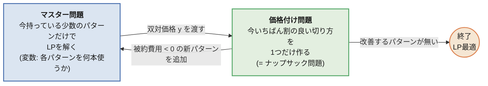
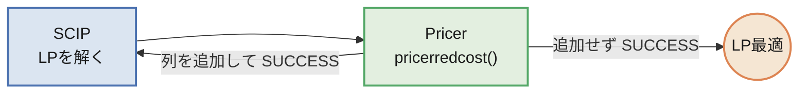
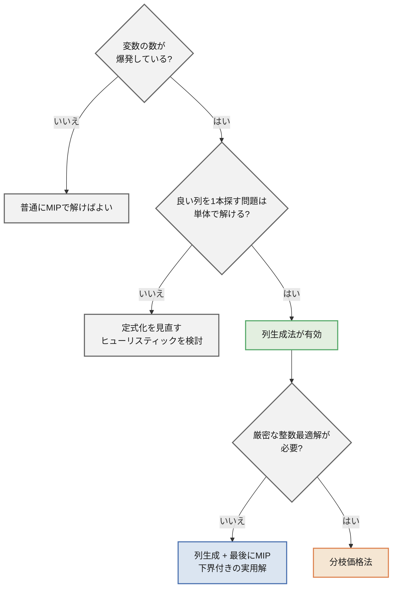

## この記事について

線形計画・混合整数計画は知っていて、定式化してソルバーに投げたこともある。
そういう人向けに、**列生成法(Column Generation)** を説明します。

題材は、製紙・鉄鋼・フィルムのスリッター工程で出てくる
**原反(ロール)の切り出し問題(カッティングストック問題)** です。

同じ問題を2通りに定式化して、実際に測った結果を先に出しておきます。

| | LP緩和の値 | 120秒後 |
| ---- | ---- | ---- |
| 素直な定式化 | 148.67(材料量から出る自明な値と同じ) | 158本、ギャップ6.3%を残して時間切れ |
| パターン定式化 + 列生成 | **149.375** | **150本。最適だと証明済み**(0.11秒) |

たった6品種の問題です。
LP緩和の値がわずか0.7本ぶん強くなっただけで、結果がここまで変わります。
その 0.7 がどこから来るのかが本題です。

:::message
コードはすべて手元で実行し、記事中の数値は実行結果をそのまま貼っています。
ソルバーはこのシリーズの標準環境である **PySCIPOpt(SCIP)** に統一しています。
実行時間とノード数は当然ながら環境依存です。

| | バージョン |
| ---- | ---- |
| Python | 3.14 |
| PySCIPOpt | 6.2.1 |
| SCIP | 10.0 |
:::

## 題材: 3000mm の原反から、注文幅を切り出す

工場には幅 3000mm の原反(ロール)があります。
お客さんからは「この幅で、この本数ほしい」という注文が来ます。


| 品種 | 幅 | 必要本数 |
| ---- | ---- | ---- |
| A | 1380mm | 40 |
| B | 1120mm | 90 |
| C | 940mm | 120 |
| D | 760mm | 60 |
| E | 610mm | 110 |
| F | 430mm | 150 |

やりたいことは単純で、**使う原反の本数を最小にしたい**。
原反1本あたりの単価は同じなので、これは端材(ロス)を減らすこととほぼ同じです
(注文本数ちょうどではなく多めに作ってしまう分もあるので、完全に同じではありません。後述します)。

注文の総幅は 446,000mm。原反1本が 3000mm なので、
$446000 / 3000 = 148.67$ より、**149本**を下回ることはありません。
ただしこの数字は「原反を溶かして流し込めるなら」の話で、実際に達成できるとは限りません。
この記事の結論を先に言うと、真の最適値は150本で、149本は達成不可能です。

## まず、素直な定式化がどうなるかを見る

意思決定変数を素直に取ると、「$k$ 本目の原反から、品種 $i$ を何本切るか」になります。
原反の使用本数に上限 $K$ を決め打ちして書くと、こうなります。

$$
\begin{aligned}
\min_{z, u} \quad & \sum_{k=1}^{K} u_k & & \text{(使った原反の本数)}\\
\text{s.t.} \quad & \sum_{i} w_i\, z_{ki} \le W u_k & & \forall k \text{(原反 } k \text{ の幅に収める)}\\
& \sum_{k} z_{ki} \ge d_i & & \forall i \text{(品種 } i \text{ の必要本数を満たす)}\\
& z_{ki} \in \mathbb{Z}_{\ge 0},\quad u_k \in \{0, 1\}
\end{aligned}
$$

- $W = 3000$: 原反の幅、$N = 6$: 品種の数
- $w_i, d_i$: 品種 $i$ の幅と必要本数
- $z_{ki}$: **$k$ 本目の原反から品種 $i$ を何本切るか**
- $u_k$: $k$ 本目の原反を使うかどうか

$K$ は「これだけあれば絶対足りる」という本数にします。
後で出てくる素朴な解が178本なので、$K = 178$ で十分です。

このとき変数の数は、

- 整数変数 $z_{ki}$: $K \times N = 178 \times 6 = \mathbf{1068}$ 本
- 0-1変数 $u_k$: $\mathbf{178}$ 本

になります。「原反の本数 × 品種数」というのはこの掛け算のことです。

### 問題は変数の数ではなく、対称性と緩和の弱さ

変数が1200本というだけなら、MIPソルバーにとっては大した規模ではありません。
効いてくるのは別の2つです。

**1つめは対称性です。**


原反には $k = 1, 2, \dots, 178$ と番号がついていますが、工場から見れば原反に個体差はありません。
上の図の2つは、モデルの上では $z$ の値が違う別々の解ですが、工場にとっては同じ切り方です。
178本の並べ替えを考えれば、同じ内容の解が天文学的な数だけモデル上に存在します。
「原反#1をこう使うのはやめよう」と枝を切っても、
まったく同じ内容の解が「原反#2として」生き残ります。

**2つめは、LP緩和が弱いことです。**
この定式化の整数条件を外して解くと、値は **148.667** になります。
これは冒頭で計算した「総幅 ÷ 原反幅」とぴったり同じ、
つまり**モデルを解いて得られる情報がゼロ**ということです。
分枝限定法は緩和の値を下界として枝を刈るので、下界がこれでは刈りようがありません。

### 実際に投げてみる

上の定式化をそのまま SCIP に渡し、120秒の制限時間で解かせました。
presolve も対称性検出も既定のまま有効にしてあります。

| | |
| ---- | ---- |
| 整数変数 / 0-1変数 / 制約 | 1068 / 178 / 184 |
| 探索したノード数 | 7,673 |
| 120秒後の暫定解 | **158本** |
| 120秒後の下界 | **148.67本**(根ノードのLP値から1ミリも動いていない) |
| 残ったギャップ | **6.3%** |

SCIP には対称性検出の機能があり、既定で有効ですが、
それでも7,673ノード探索して下界は根ノードから改善していません。

素直な定式化は、**書けるが解けない**。ここが出発点です。

## 定式化を変える: 「切り方」を変数にする

実務では、意思決定の単位を「原反1本ごと」ではなく「**切り方(パターン)**」に変えます。

> パターン = 原反1本をどう切り分けるかの組み合わせ
> 例:「1380mm を1本 + 760mm を1本 + 430mm を2本 (ロス 0mm)」

そして「そのパターンで**何本**切るか」を変数にします。
原反に番号がなくなるので、対称性が消えます。

$$
\begin{aligned}
\min_{x} \quad & \sum_{p \in P} x_p & & \text{(使う原反の本数)}\\
\text{s.t.} \quad & \sum_{p \in P} a_{ip}\, x_p \ge d_i & & \forall i \text{(品種 } i \text{ の必要本数を満たす)}\\
& x_p \ge 0
\end{aligned}
$$

- $P$: すべての切り方(パターン)の集合
- $a_{ip}$: パターン $p$ の中に品種 $i$ が何本含まれるか
- $x_p$: パターン $p$ を何本使うか

制約は品種の数(ここでは6本)だけになりました。

パターン $p$ ひとつは、係数行列の1列 $(a_{1p}, \dots, a_{Np})^\top$ に対応します。
以降、パターンのことを **列**とも呼びます。「列生成」の「列」はこれです。

:::message
**$x_p$ が整数でないことについて**

本当は「パターン $p$ を 2.5 本使う」はあり得ないので $x_p$ は整数であるべきです。
整数条件をわざと外したものを **LP緩和**と呼びます。

外す理由は、このあと使う **双対価格が線形計画(LP)にしか存在しない**からです。
整数条件を外した分だけ答えは甘くなりますが、
その代わり「元の整数問題の最適値はこの値以上」という**下界**が手に入ります。
下界の質がそのまま解きやすさに直結することは、素直な定式化の 148.667 で見たとおりです。
:::

### $P$ が爆発する

問題は $P$ の大きさです。パターンの総数は品種数に対して指数的に増えます。


グラフは「原反幅3000mm、指定したレンジに品種の幅を等間隔に並べたとき、
これ以上詰められない切り方が何通りあるか」を全列挙して数えたものです。

- この記事の6品種(実際の幅)なら **50通り**。全部並べてMIPに渡せば終わりです
- 品種が40に増えると、幅レンジが 430〜1380mm でも **26,965通り**
- 同じ40品種でも、200mm の細幅が混じるだけで **419,189通り**
- 150〜1400mm を100品種なら **約8.3億通り**

実務の受注は数十〜数百品種あるので、後ろ2つが現実的な規模です。そうなると、

- 全列挙するとメモリに乗らない
- 乗ったとしてもLPを1回解くのに時間がかかりすぎる

「定式化はきれいなのに、変数を全部書き出せない」という状態です。

## 列生成法: 全部作らず、必要になったものだけ作る

手がかりは、**最後に値がつく列はごく少ない**という事実です。

LPの理論から、**最適解のうち少なくとも1つ(最適基底解)は、
値がゼロでない変数の数が制約の本数以下**になります。
この問題なら制約は6本(品種数)なので、
列が50本あろうと8億本あろうと、**値がつくのは高々6本**です。

実際、このあとの実行でモデルに載る列は16本(初期6本 + 生成10本)だけで、
そのうち最終的なLP解で値がついたのは6本でした。
50通りのうち37通りは、一度も姿を見せないまま終わります。

だったら、最初から全部用意するのはやめて、
**「今の解を改善してくれる列」だけを、必要になった時点で作ればいい**。
これが列生成法です。そのために、問題を2つに分けます。



- **マスター問題**: 手持ちのパターンだけを列に持つLP。
  列が制限されているので **RMP(制限付きマスター問題)** と呼びます。小さいのですぐ解けます。
- **価格付け問題**: 「マスター問題に追加すると解が良くなる列はどれか」を探す問題。
  パターンを列挙するのではなく、**最適化で1本作る**のがポイントです。

この図を1周することを **1反復(イテレーション)** と呼びます。
1反復ごとに列が1本増え、**そのたびにRMPを解き直します**。
列 = 選択肢が増えるだけなので、RMPのLP値は反復とともに単調非増加です。

そして「もう改善する列は存在しない」と分かった時点で、
**全パターンを列挙したときのLP最適解と同じ答え**に到達しています。
なぜそう言えるのかは、双対問題を書けばはっきりします。

## ステップ1: 適当な初期パターンから始める

まずは何でもいいので、実行可能な初期パターンを用意します。
定番は「1品種だけを詰め込むパターン」です。


これだけで注文はすべて満たせますが、見てのとおりロスだらけです。
LPで解くと 177.5 本、整数に丸めて **178本**。歩留まりは 83.5% です。

## ステップ2: 双対問題を書き下す

マスター問題(LP)は次の形でした。

$$
\begin{aligned}
\min_{x \ge 0} \quad & \sum_{p \in P} x_p \\
\text{s.t.} \quad & \sum_{p \in P} a_{ip}\, x_p \ge d_i \quad \forall i
\end{aligned}
$$

各制約(品種 $i$ の必要本数)に双対変数 $y_i \ge 0$ を対応させると、双対問題はこうなります。

$$
\begin{aligned}
\max_{y \ge 0} \quad & \sum_{i} d_i\, y_i \\
\text{s.t.} \quad & \sum_{i} a_{ip}\, y_i \le 1 \quad \forall p \in P
\end{aligned}
$$

見るべきは対応関係です。

- 主問題の**列** $p$ が、双対問題では**制約** $\sum_i a_{ip} y_i \le 1$ になる
- 主問題で列を全部持てない = 双対問題で制約を全部持てない
- **列を追加する = 双対問題で「今の $y$ が破っている制約」を1本見つけて追加する**

つまり列生成は、双対側から見れば切除平面法です。
最適性の議論も、これで最後まで書けます。

1. RMP を解いて得た $y$ は、**RMP の最適双対解**です。
   RMP の中では強双対性が成り立つので、$\sum_i d_i y_i$ は RMP の最適値そのものです
2. ここで「$P$ 全体を見ても $\sum_i a_{ip} y_i \le 1$ を破る $p$ は無い」と確認できたとする。
   すると $y$ は**全体の双対問題の実行可能解**になる
3. 弱双対性より、全体LPの最適値 $\ge \sum_i d_i y_i$ = RMPの最適値
4. 一方、RMP は全体LPの列を制限したものなので、RMPの最適値 $\ge$ 全体LPの最適値
5. 両方から挟まれて**等号**。RMPの解が全体LPの最適解

「一部の列しか見ていないのに、全部見たのと同じ結論が言える」の中身はこれです。
2 の確認をどうやるかが、次のステップになります。

### $y_i$ は何を表す数か

双対変数の一般的な意味は「制約の右辺を1単位緩めたときの目的関数の変化量」です。
この問題に当てはめると、

> $y_i$ = **品種 $i$ の注文を1本増やしたとき、必要な原反が何本増えるか**

になります。単位は「原反の本数 / 品種 $i$ 1本」です。

これは比喩ではないので、実際に確かめました。
品種ごとに需要 $d_i$ を1本だけ増やし、**列生成を最初からやり直して**解いた結果です。

| 品種 | 双対価格 $y_i$ | 需要を+1したときのLP最適値の増分 |
| ---- | ---- | ---- |
| A (1380mm) | 0.4583 | 149.8333 − 149.375 = **+0.4583** |
| B (1120mm) | 0.3750 | 149.7500 − 149.375 = **+0.3750** |
| C (940mm) | 0.3125 | 149.6875 − 149.375 = **+0.3125** |
| D (760mm) | 0.2500 | 149.6250 − 149.375 = **+0.2500** |
| E (610mm) | 0.2083 | 149.5833 − 149.375 = **+0.2083** |
| F (430mm) | 0.1458 | 149.5208 − 149.375 = **+0.1458** |

小数点以下4桁まで一致しました。


図は1反復目の $y_i$ と収束後の $y_i$ を並べたものです。
収束後の値は「幅 ÷ 3000」にほぼ一致しています。
ロスなく切れているなら品種 $i$ が1本増えて増える原反は $w_i / W$ 本ぶんのはずなので、
これは「ほぼロスなく切れる状態に到達した」ことの裏返しです。
逆に、この線から離れている品種は、まだうまく切れていない品種ということになります。

## ステップ3: 価格付け問題はナップサック問題になる

破るべき双対制約は $\sum_i a_{ip} y_i \le 1$ でした。
つまり $\sum_i y_i a_i > 1$ となる列 $a = (a_1, \dots, a_N)$ を探せばいい
($a_{ip}$ から添字 $p$ を落として、これから作る1本の列を $a$ と書きます)。

主問題の言葉で書けば **被約費用(reduced cost)** です。

$$
\bar{c} = \underbrace{1}_{\text{原反1本のコスト}} - \sum_{i} y_i a_i
$$

$\bar{c} < 0$ なら、その列は追加する価値があります。
いちばん $\bar{c}$ が小さい列を探すには $\sum_i y_i a_i$ を最大化すればよく、
制約は「幅の合計が3000mmを超えない」だけです。

$$
\max_{a \ge 0,\ \text{整数}} \sum_i y_i a_i \quad \text{s.t.} \quad \sum_i w_i a_i \le W
$$

同じ品種を何本でも入れられるので、**非有界ナップサック問題**です
(実際には $a_i \le \lfloor W / w_i \rfloor$ で上限がつきます)。


図は4反復目の様子です。そのときの $y$ を価値としてナップサックを解くと
「D を1本 + F を5本」が返り、価値の合計は 1.097。
1 を超えているので被約費用は $-0.097$、この列は追加する価値がある、と判定されます。

パターンを列挙する代わりに、**小さなナップサック問題を1回解くだけ**で
「今いちばん役に立つ列」を1本取り出せます。

:::message
ナップサック問題は弱NP困難で、容量に対する擬多項式時間のDPがあります。
幅の種類が数十、容量が数千程度ならDPでもMIPでも一瞬です。
「指数個の列挙」が「小さな最適化問題1回」に化けたのがポイントです。
:::

## ステップ4: 実装する

ソルバーは SCIP(PySCIPOpt)を使います。

```bash
pip install pyscipopt
```

### 先に注意: SCIPから双対価格を取り出す

列生成ではマスター問題の双対価格が命ですが、SCIP に素直に投げると取れません。理由は2つあります。

**1つめ。整数計画には双対価格が存在しません。**
双対価格は「制約を1単位緩めたときの目的関数の変化量」でしたが、
整数問題では右辺を少し緩めても最適解が飛び移るだけで、傾きが定義できません。
上で書いた双対問題も、主問題がLPだから成り立ちます。
したがって**マスター問題は連続変数(`vtype="C"`)で解く**必要があります。

**2つめ。SCIPの前処理(presolve)が問題を書き換えます。**
SCIPはMIPソルバーなので、既定では presolve が変数を消したり制約をまとめたりします。
書き換わった後の問題の双対値は、こちらが書いた制約とは対応しません。
PySCIPOpt の `getDualSolVal()` はその対応が取れないときに 0 を返すため、全部0になります。

同じLPを設定だけ変えて解いた結果です。

| 設定 | 変数 | `getDualSolVal()` の結果 |
| ---- | ---- | ---- |
| presolve等をOFF | 連続 | `[0.5, 0.5, 0.333, 0.333, 0.25, 0.167]` ← 正しい |
| デフォルト | 連続 | `[0, 0, 0, 0, 0, 0]` ← presolveで対応が切れた |
| presolve等をOFF | 整数 | `[0.5, 0.5, 0.333, 0.333, 0.0, 0.167]` ← Eだけ0。値として意味がない |

3行目が厄介です。整数で解いても**エラーにはならず、それらしい数字が返ります**。
品種Eだけ 0 になっていますが、これは「Eの需要を増やしてもコストが増えない」という意味ではなく、
単に整数問題に双対価格が定義されていないだけです。気づかずに使うと、
価格付け問題がEを永久に無視した列を作り続けます。

マスター問題は、変数を連続にして、presolve / heuristics / propagation を切る。この2点です。

:::message alert
筆者の環境(PySCIPOpt 6.2.1)では、モデルを直接解いた場合 `getDualsolLinear()` は 0 を返しました。
双対価格は **`getDualSolVal()`** で取ってください。
(後述の Pricer プラグインの中では `getDualsolLinear()` が正しく動きます)
:::

### 実装

```python
from pyscipopt import Model, quicksum, SCIP_PARAMSETTING

W = 3000  # 原反幅[mm]
ORDERS = [("A", 1380, 40), ("B", 1120, 90), ("C", 940, 120),
          ("D", 760, 60), ("E", 610, 110), ("F", 430, 150)]
WIDTHS = [w for _, w, _ in ORDERS]
DEMANDS = [d for _, _, d in ORDERS]
N = len(ORDERS)
MAX_ITER = 100


def solve_master(patterns, integer=False):
    """マスター問題: 手持ちパターンだけで「何本ずつ使うか」を決める。

    integer=False のときは LP として解き、双対価格も返す。
    """
    m = Model("master")
    m.hideOutput()
    if not integer:
        # presolveが問題を書き換えると、元の制約に対応する双対価格が取れなくなる
        m.setPresolve(SCIP_PARAMSETTING.OFF)
        m.setHeuristics(SCIP_PARAMSETTING.OFF)
        m.disablePropagation()

    vtype = "I" if integer else "C"
    x = [m.addVar(vtype=vtype, lb=0, obj=1.0, name=f"x{j}") for j in range(len(patterns))]
    m.setMinimize()  # 使う原反の本数を最小化

    cons = []
    for i in range(N):
        c = m.addCons(
            quicksum(patterns[j][i] * x[j] for j in range(len(patterns))) >= DEMANDS[i],
            name=f"demand_{i}")
        cons.append(c)

    m.optimize()
    # 双対価格はLPにしか存在しない
    duals = None if integer else [m.getDualSolVal(c) for c in cons]
    return m.getObjVal(), [m.getVal(v) for v in x], duals


def solve_pricing(duals):
    """価格付け問題: 双対価格を「価値」とみなした非有界ナップサック問題"""
    m = Model("pricing")
    m.hideOutput()
    a = [m.addVar(vtype="I", lb=0, obj=duals[i], name=f"a{i}") for i in range(N)]
    m.setMaximize()                                                 # 価値の合計を最大化
    m.addCons(quicksum(WIDTHS[i] * a[i] for i in range(N)) <= W)    # 原反幅に収める
    m.optimize()
    return m.getObjVal(), [int(round(m.getVal(v))) for v in a]


# 初期パターン: 1品種だけを詰め込む
patterns = [[W // WIDTHS[i] if i == j else 0 for i in range(N)] for j in range(N)]

# --- 列生成のループ(1周が1反復) ---
for it in range(1, MAX_ITER + 1):
    obj, xs, duals = solve_master(patterns)      # RMPを解き直して双対価格を得る
    val, new_pattern = solve_pricing(duals)      # 一番おいしい切り方を1つ作る
    reduced_cost = 1 - val
    lower = obj / (1 - reduced_cost)             # 収束前でも使える下界(後述)
    print(f"[{it}] RMP={obj:.3f} 被約費用={reduced_cost:+.4f} "
          f"下界={lower:.3f} 新パターン={new_pattern}")

    if reduced_cost > -1e-6:                     # 双対制約を破る列がもう無い = LP最適
        print("  -> LP最適に到達")
        break
    patterns.append(new_pattern)                 # 列を1本追加して次の反復へ
else:
    print(f"  -> {MAX_ITER}反復で打ち切り(未収束)")

# 最後に、生成された列だけを使って整数計画として解く
lp_obj, _, _ = solve_master(patterns)
ip_obj, ip_x, _ = solve_master(patterns, integer=True)
print(f"LP最適値={lp_obj:.3f} / 整数解={ip_obj:.0f} / モデルの列数={len(patterns)}")
produced = [0] * N
for p, v in zip(patterns, ip_x):
    if v > 0.5:
        loss = W - sum(WIDTHS[i] * p[i] for i in range(N))
        print(f"  {p} x {v:.0f}  ロス{loss}mm")
        for i in range(N):
            produced[i] += p[i] * v
print(f"生産本数={[int(v) for v in produced]} / 必要本数={DEMANDS}")
```

列生成法の実装そのものは、`solve_master()` と `solve_pricing()` を交互に呼ぶだけです。

### 実行結果

```txt
[1] RMP=177.500 被約費用=-0.3333 下界=133.125 新パターン=[0, 2, 0, 1, 0, 0]
[2] RMP=162.500 被約費用=-0.2500 下界=130.000 新パターン=[0, 0, 0, 3, 1, 0]
[3] RMP=161.250 被約費用=-0.1667 下界=138.214 新パターン=[0, 0, 0, 0, 4, 1]
[4] RMP=156.875 被約費用=-0.0972 下界=142.975 新パターン=[0, 0, 0, 1, 0, 5]
[5] RMP=155.417 被約費用=-0.0833 下界=143.462 新パターン=[0, 1, 0, 0, 0, 4]
[6] RMP=154.808 被約費用=-0.0513 下界=147.256 新パターン=[0, 1, 2, 0, 0, 0]
[7] RMP=152.377 被約費用=-0.0574 下界=144.109 新パターン=[1, 0, 0, 1, 0, 2]
[8] RMP=150.192 被約費用=-0.0385 下界=144.630 新パターン=[0, 0, 0, 0, 2, 4]
[9] RMP=149.881 被約費用=-0.0238 下界=146.395 新パターン=[0, 0, 0, 2, 1, 2]
[10] RMP=149.821 被約費用=-0.0179 下界=147.193 新パターン=[0, 1, 0, 0, 3, 0]
[11] RMP=149.375 被約費用=+0.0000 下界=149.375 新パターン=[0, 0, 0, 0, 2, 4]
  -> LP最適に到達
LP最適値=149.375 / 整数解=150 / モデルの列数=16
  [0, 2, 0, 1, 0, 0] x 3  ロス0mm
  [0, 1, 2, 0, 0, 0] x 60  ロス0mm
  [1, 0, 0, 1, 0, 2] x 40  ロス0mm
  [0, 0, 0, 0, 2, 4] x 13  ロス60mm
  [0, 0, 0, 2, 1, 2] x 9  ロス10mm
  [0, 1, 0, 0, 3, 0] x 25  ロス50mm
生産本数=[40, 91, 120, 61, 110, 150] / 必要本数=[40, 90, 120, 60, 110, 150]
```

11反復、追加した列は10本、列生成から最後のMIPまで含めて 0.11 秒でした。


(a) の読み方に注意してください。青い線は**列を1本足すたびにRMPを解き直した結果**です。
1反復目から2反復目で 177.5 → 162.5 と15本ぶん下がっているのは、
`[0, 2, 0, 1, 0, 0]`(1120mm×2 + 760mm、ロス0mm)という列が選択肢に加わったからです。
それまでの手持ちは「1品種だけを詰めた6本」しかなかったので、
混ぜて切れる列が1本入っただけで大きく改善します。

紫の線は次の節で説明する下界です。上下から挟み込んで、11反復目で一致します。

(b) は各反復で見つかった列の被約費用です。
序盤ほど改善余地の大きい列が見つかり、終盤は痩せていきます。
11反復目に被約費用が 0 になり、
「双対制約を破る列はもう存在しない = LP最適」が証明されて終了します。

得られた解がこちらです。


| | 使用本数 | 歩留まり |
| ---- | ---- | ---- |
| 初期パターン(1品種詰め)のみ | 178本 | 83.5% |
| **列生成 + 整数化** | **150本** | **99.1%** |

同じ注文を原反28本(約16%)少なく作れます。

:::message
需要制約が $\ge$ なので、**B と D が1本ずつ余分に生産されています**(生産本数の行を参照)。
150本 × 3000mm = 450,000mm に対し、端材が 2,120mm、過剰生産が 1,880mm。
歩留まり 99.1% はこの両方をロスとして数えた値です。
過剰生産が許されない現場では、制約を $=$ にして解くことになります
(その場合、価格付け問題は同じままで、双対価格 $y_i$ の符号制約が外れるだけです)。
:::

### 途中で止めたときに何が言えるか

ここは間違えやすいところです。
**収束前のRMPのLP値は、全体LPの上界であって下界ではありません。**
上の実行ログでも 8反復目の 150.192 は真の最適値 149.375 より上にあります。
これを「下界」として報告すると誤りになります。

途中で打ち切っても下界が欲しい場合は、双対解をスケールし直します。
価格付けで得た最小被約費用 $\bar{c}_{\min} < 0$ に対して $\theta = 1 / (1 - \bar{c}_{\min}) \le 1$ とおくと、
すべての列 $p$ について

$$
\sum_i \theta y_i a_{ip} = \theta\,(1 - \bar{c}_p) \le \theta\,(1 - \bar{c}_{\min}) = 1
$$

なので、$\theta y$ は**全体の双対問題の実行可能解**になります。弱双対性から、

$$
z_{\text{LP}} \ \ge \ \sum_i d_i\,\theta y_i \ = \ \frac{z_{\text{RMP}}}{1 - \bar{c}_{\min}}
$$

これが実行ログの「下界」の列で、**ラグランジュ下界(Farley界)** と呼ばれます。
収束すると $\bar{c}_{\min} = 0$ になるので、下界はRMP値と一致します。

グラフ(a)の紫の線を見ると、この下界は**単調に上がるわけではありません**
(6反復目の 147.256 が7反復目に 144.109 まで落ちています)。
双対価格が反復ごとに振れるためで、実務ではそれまでの最良値を保持しておきます。

## LP緩和と整数解のあいだ

**列生成法が最適性を保証してくれるのは LP緩和 に対してだけ**です。
上の例では LP の最適値が 149.375 本でしたが、原反を 0.375 本使うことはできません。

ここで、冒頭の2つの定式化を並べます。

| | LP緩和の値 | 切り上げ |
| ---- | ---- | ---- |
| 素直な定式化 | 148.667 | 149本 |
| パターン定式化 | **149.375** | **150本** |

同じ問題、同じ最適値なのに、**定式化を変えただけで下界が 0.7 本ぶん強くなりました**。
そして 150 は実際に達成できたので、

- LP最適値 149.375 は、すべてのパターンを考慮した上での下界(価格付けで証明済み)
- 目的関数は整数なので、真の最適値は $\lceil 149.375 \rceil = 150$ 本以上
- 実際に150本の整数解が見つかった

の3つが揃い、**150本が真の最適解**だと言い切れます。
冒頭で計算した材料量の下界 149 は、達成できない値だったわけです。

パターン定式化への置き換えは Dantzig-Wolfe 分解の一例で、
「対称性が消える」よりも、この**緩和が強くなる**ほうが本質的な効能です。

いつもこう上手くいくわけではありません。LP下界と整数解のあいだにギャップが残る場合は、

1. **LP解を丸めて、足りない分を追加で作る**(実務ではこれで十分なことも多い)
2. **生成された列だけで整数計画を解く**(今回やった方法)
3. **分枝価格法(Branch-and-Price)** — 分枝限定法の各ノードで列生成を回す厳密解法

という順に手が重くなります。
2 は実装コストと効果のバランスが良く、現場でよく使われます。

:::message alert
2で得られた解は「生成された列の範囲での最適解」であって、全体の最適解とは限りません。
ただしLP下界が同時に手に入るので、**最適値との差が最大で何%かを常に言える**のが強みです。
上の例なら $(150 - 149.375)/149.375 = 0.42\%$ 以内、と報告できます。
:::

### 一度生成した列は消えないのか

消えません。追加した列はモデルに残り続け、使われなくなれば $x_p = 0$ になるだけです。


初期6列 + 生成10列で合計16列になりましたが、
最終的なLP解で値がついたのは6列で、初期の6列は全滅しています。
反復の途中では役に立った列(たとえば `[0, 0, 0, 3, 1, 0]`)も、
より良い列が後から入ったことで 0 に落ちました。

大規模な問題では、長く $x_p = 0$ のままの列をモデルから削除することがあります
(**列プール管理 / column deletion**)。
消した列が後で必要になっても価格付け問題が作り直してくれるので、正しさは壊れません。
ただし「消す→また作る」を繰り返して振動する原因にもなるので、削除の閾値は慎重に決めます。

## SCIPの Pricer プラグインに列生成を任せる

上のコードは反復のたびにマスター問題をゼロから作り直しています。
分かりやすい代わりに、問題が大きくなるとここがボトルネックになります。

SCIP には **Pricer** というプラグインの仕組みがあり、
「LPを解いた後に呼ばれて、必要なら列を追加する」処理を登録できます。
こうすると SCIP が**ウォームスタートしながら**列生成を回してくれます。



```python
from pyscipopt import Model, Pricer, SCIP_RESULT, SCIP_PARAMSETTING, quicksum

W = 3000
ORDERS = [("A", 1380, 40), ("B", 1120, 90), ("C", 940, 120),
          ("D", 760, 60), ("E", 610, 110), ("F", 430, 150)]
WIDTHS = [w for _, w, _ in ORDERS]
DEMANDS = [d for _, _, d in ORDERS]
N = len(ORDERS)


class PatternPricer(Pricer):
    """LPを解くたびにSCIPから呼ばれ、被約費用が負のパターンを1本追加する。"""

    def pricerredcost(self):
        cons = self.data["cons"]
        duals = [self.model.getDualsolLinear(c) for c in cons]

        # 価格付け問題(ナップサック)を別モデルとして解く
        sub = Model("pricing")
        sub.hideOutput()
        a = [sub.addVar(vtype="I", lb=0, obj=duals[i]) for i in range(N)]
        sub.setMaximize()
        sub.addCons(quicksum(WIDTHS[i] * a[i] for i in range(N)) <= W)
        sub.optimize()

        reduced_cost = 1 - sub.getObjVal()
        pattern = [int(round(sub.getVal(v))) for v in a]
        if reduced_cost < -1e-6 and pattern not in self.data["patterns"]:
            # マスター問題に列(変数)を1本追加する
            newvar = self.model.addVar(f"x{len(self.data['patterns'])}",
                                       vtype="C", lb=0, obj=1.0, pricedVar=True)
            for c, coef in zip(cons, pattern):
                self.model.addConsCoeff(c, newvar, coef)   # 既存制約に係数を差し込む
            self.data["patterns"].append(pattern)
            print(f"  + 新パターン {pattern} (被約費用 {reduced_cost:+.4f})")
        return {"result": SCIP_RESULT.SUCCESS}

    def pricerinit(self):
        # 元の制約を「変換後の制約」に差し替える(双対価格はこちらから取る)
        self.data["cons"] = [self.model.getTransformedCons(c) for c in self.data["cons"]]


m = Model("cutting-stock")
m.setPresolve(SCIP_PARAMSETTING.OFF)
m.setIntParam("presolving/maxrestarts", 0)
m.setParam("misc/allowstrongdualreds", 0)
m.hideOutput()

patterns = [[W // WIDTHS[i] if i == j else 0 for i in range(N)] for j in range(N)]
x = [m.addVar(vtype="C", lb=0, obj=1.0, name=f"x{j}") for j in range(N)]
m.setMinimize()

cons = []
for i in range(N):
    c = m.addCons(
        quicksum(patterns[j][i] * x[j] for j in range(N)) >= DEMANDS[i],
        name=f"demand_{i}",
        separate=False, modifiable=True)   # modifiable=True が「列が増える」宣言
    cons.append(c)

pricer = PatternPricer()
m.includePricer(pricer, "PatternPricer", "原反の切り方を必要に応じて生成する")
pricer.data = {"cons": cons, "patterns": patterns}

m.optimize()
print(f"LP最適値 = {m.getObjVal():.3f} 本 / モデルの列数 = {len(pricer.data['patterns'])}")
```

```txt
  + 新パターン [0, 2, 0, 1, 0, 0] (被約費用 -0.3333)
  + 新パターン [0, 0, 0, 3, 1, 0] (被約費用 -0.2500)
  + 新パターン [0, 0, 0, 0, 4, 1] (被約費用 -0.1667)
  + 新パターン [0, 0, 0, 1, 0, 5] (被約費用 -0.0972)
  + 新パターン [0, 1, 0, 0, 0, 4] (被約費用 -0.0833)
  + 新パターン [0, 1, 2, 0, 0, 0] (被約費用 -0.0513)
  + 新パターン [1, 0, 0, 1, 0, 2] (被約費用 -0.0574)
  + 新パターン [0, 0, 0, 0, 2, 4] (被約費用 -0.0385)
  + 新パターン [0, 0, 0, 2, 1, 2] (被約費用 -0.0238)
  + 新パターン [0, 1, 0, 0, 3, 0] (被約費用 -0.0179)
LP最適値 = 149.375 本 / モデルの列数 = 16
```

手書きループと同じ列・同じ値に到達しました。実装のポイントは3つです。

- 制約を **`modifiable=True`** で作る(「あとから列が増える」ことをSCIPに伝える)
- 追加する変数は **`pricedVar=True`**、係数は `addConsCoeff()` で既存制約に差し込む
- `pricerinit()` で制約を `getTransformedCons()` に差し替える

### 変数を整数にすると何が起きるか

上のコードで、マスターの変数を(初期列も生成列も)`vtype="I"` にすると、
SCIPは分枝限定法を始めます。ここで列生成と分枝限定法の相性の悪さが表に出ます。

原因ははっきりしています。**価格付け問題は分枝の条件を一切知りません**。
Pricer が受け取るのは双対価格 $y$ だけで、
「このノードでは $x_7 \le 3$ に制限されている」という情報はナップサック問題のどこにも入っていません。
だからナップサックは、そのノードでも $y$ にとっての最良解、
つまり**制限されたはずのパターンそのもの**を返してきます。

実際に測った結果です。上のコードから重複チェック
(`pattern not in self.data["patterns"]`)を外し、120秒で打ち切りました。

| | |
| ---- | ---- |
| 探索ノード数 | 28,744 |
| 価格付けの呼び出し回数 | 28,873 |
| `[0, 2, 0, 1, 0, 0]` が返された回数 | 936回 → うち **79回が新しい列として追加された** |
| `[0, 0, 0, 0, 2, 4]` が返された回数 | 14,011回 → うち **30回が追加された** |
| モデルの列 | **135本。ただし中身は21種類しかない** |
| 結果 | 時間切れ。最適性は証明できず |

同じ内容の列が、名前だけ違う変数として何度も追加されています。
`[0, 2, 0, 1, 0, 0]` に至っては79本の別変数になりました。

これは分枝が効かなくなることを意味します。
SCIPが「変数 $x_7$ は3本以下」と枝を切っても、
Pricer が $x_7$ と中身の同じ $x_{53}$ を上限なしで追加してしまえば、その枝は無効化されます。
分枝で狭めたそばから、価格付けが同じ穴を開け直しています。

重複チェックを戻せば、同じ列の再追加は止まります。ただし今度は別の問題が出ます。

| 重複チェックあり(120秒) | |
| ---- | ---- |
| 探索ノード数 | 34,806 |
| 価格付けの呼び出し回数 | 34,827 |
| うち `[0, 2, 0, 1, 0, 0]` が返された回数 | 7,736回(追加されたのは最初の1回だけ) |
| 新しい列を追加できた回数 | 21回 |
| 下界 / 暫定解 | 149.467 / 150 |
| 結果 | 時間切れ。150本が最適だと証明できず |

34,827回の価格付けのうち、新しい列になったのは21回だけです。
残りの3万回超は、すでにモデルにある列をナップサックで作り直しているだけです。

しかもこの重複チェックは、**「そのノードのLPを最適まで解いた」ことを保証しません**。
価格付けが返すのは $\sum_i y_i a_i$ の最大値を与える1本だけなので、
それが既存の列だった場合、2番目に良い列(こちらは未追加かもしれない)は探されないまま
`SUCCESS` を返してしまいます。ノードの下界が本来より高く出る可能性が残ります。

まとめると、

- **重複チェックがなければ**、同じ列が名前を変えて追加され、分枝が無効化される
  (実測: 同じパターンが79本の別変数になった)
- **重複チェックがあれば**、列は増えなくなるが、そのノードのLPを解き切ったとは言えず、
  加えて $x_p$ での分枝は規則として弱い。6品種の問題ですら34,806ノード回して証明できない

どちらにしても、$x_p$ を整数にして SCIP に任せる素朴な組み合わせは成立しません。
これは実装ミスではなく、**分枝の情報を価格付け問題にどう伝えるかを設計する必要がある**という
構造的な問題です。それを扱うのが次回の **分枝価格法(Branch-and-Price)** です。

そのため、この記事の範囲では
「マスター問題はLPとして解き、最後に生成された列だけで整数計画を解き直す」という
折衷を採っています。

## 実務で使うときの勘所

### 原反1本の中で閉じた制約は、価格付け問題に押し込める

実務のカッティングストックには、こんな制約がついて回ります。

- ナイフの本数上限(1本の原反から切れる本数は最大◯本まで)
- 最小・最大の端材幅(端材が細すぎると巻き取れない)
- 同時に使える品種の組み合わせ制限、刃の位置の制約

これらはいずれも**原反1本の中で完結する条件**なので、
価格付け問題(ナップサック)側の制約として追加できます。
マスター問題は「パターンを何本使うか」のままで、モデル構造は変わりません。
複雑なルールを部分問題に隔離できるのが、列生成法の設計上の利点です。

逆に、**複数の原反にまたがる条件は押し込めません**。次がその例です。

### 段取り替え(パターン切替)コスト

「使うパターンの種類を減らしたい」という要求は非常によくあります。
刃の位置を変える段取り替えに時間がかかるからです。

素直に書くなら、パターンを使うかどうかの0-1変数 $z_p$ を入れて
$x_p \le M z_p$、$\sum_p z_p \le S$($S$ は許容するパターン種類数)とします。
ただしこれはマスター問題に整数変数を持ち込むことになるので、上で見たとおり双対価格が取れません。
分枝価格法にするか、「列生成で候補を集めてから最後にMIPで種類数を絞る」折衷になります。

### 退化と振動

列生成は理論はきれいですが、実装すると次の2つによく当たります。

- **退化(degeneracy)**: 最適基底が一意に決まらないため、
  同じLP値に対して双対価格が何通りもあり、反復ごとに大きく振れる
- **テーリングオフ(tailing-off)**: 最後の数%を詰めるのに反復回数が異常にかかる


(a) は本記事の実測値です。11反復しかない小さな問題でも、
品種Dの双対価格は $0.264 \to 0.167 \to 0.231$ と、1反復で37%下がって次に38%上がっています。
$y$ がこれだけ動くと、価格付け問題は毎回違う方向の列を作ってしまいます。
先ほど下界が 147.256 から 144.109 に落ちたのも、これが原因です。

(b) は品種数が増えたときに起きることの模式図です。実測ではなく、典型的な形を描いたものです。

- **平らな区間**が退化です。列を足してもLP値がまったく動かない反復が何十回も続きます
  (基底が入れ替わるだけで目的関数値が変わらない)
- 前半で最適値のすぐ近くまで一気に落ちたあと、**残り数%に数百反復かかる**のがテーリングオフです

対策としては、1反復で上位k列をまとめて追加する、
双対価格の変動を抑える**安定化列生成(dual stabilization)**、
価格付けを厳密に解かず負の被約費用が見つかった時点で打ち切るヒューリスティック価格付け、
そして**打ち切り条件を緩める**、といったものがあります。

実務では最後の「そこそこで止める」が一番効きます。
ラグランジュ下界が反復ごとに手に入るので、
「最適値との差は最大◯%」という保証は付けたまま止められるからです。

### マスター問題は解き直さない

本気で実装するなら、マスター問題を毎回作り直すのではなく
列を追加して**ウォームスタート**するのが定石です。
列生成の時間の大半はマスター問題のLPに消えるので、ここが一番効きます。

上で紹介した SCIP の Pricer プラグインを使えば、この部分はソルバー任せにできます。
自前でループを書く場合も、双対単体法でウォームスタートできるAPIがあるソルバーを選ぶとよいです。

## カッティングストック以外の応用

列生成法は「変数(列)が指数的に多いが、良い列を1本作る問題は簡単」という構造があれば使えます。

| 問題 | 1つの列(パターン)が意味するもの | 価格付け問題 |
| ---- | ---- | ---- |
| カッティングストック | 原反1本の切り方 | ナップサック問題 |
| 乗務員・シフト作成 | 1人分の1週間の勤務パターン | 制約付き最短路問題 |
| 配送計画(VRP) | 1台のトラックの1ルート | 資源制約付き最短路問題 |
| ビンパッキング | 1つの箱の詰め方 | ナップサック問題 |
| 生産ロット計画 | 1ラインの生産スケジュール | 単一品目ロットサイジング |

たとえばシフト作成なら、「連続勤務は5日まで」「夜勤の翌日は休み」といった
個人単位のルールは全部、列(=1人分の勤務パターン)を作る側に隔離されます。
マスター問題は「各時間帯に必要な人数を満たすようパターンを選ぶ」という集合被覆問題になり、
現場のルールが増えてもモデルの骨格が崩れません。



## まとめ

- 「原反1本ごと」を変数にすると、原反の並べ替えぶんだけ同じ解が重複し、
  かつLP緩和が材料量の下界と同じ値にしかならない。今回は120秒で6.3%のギャップが残った
- 「パターンを何本使うか」に変えると対称性が消え、LP緩和も 148.667 → 149.375 と強くなる。
  切り上げが 149 → 150 に変わり、それが真の最適値だった
- 代償としてパターン数が指数的に爆発するが、
  LP最適解で値がつく列は高々「制約の本数」なので、必要な列だけ都度作れば足りる
- 双対問題では主問題の1つの列が1つの制約に対応する。
  列生成は**双対問題の破られている制約を1本ずつ見つける**手続きで、
  破られている制約が無いと確認できた時点でLP最適が証明される。
  探すのは $y$ を価値としたナップサック問題1回で済む
- 収束前のRMPの値は**上界**。下界が欲しければ $z_{\text{RMP}} / (1 - \bar{c}_{\min})$ を使う
- SCIPで解くならマスター問題は連続変数 + presolve類OFF。
  素朴に整数変数にすると、価格付け問題が分枝の条件を知らないため破綻する

この最後の点を解決するのが、次回扱う **分枝価格法(Branch-and-Price)** です。

@[card](https://zenn.dev/ctenopoma/articles/branch-and-price)

## 参考

@[card](https://scmopt.github.io/opt100/)
@[card](https://pyscipopt.readthedocs.io/en/latest/)

- Gilmore, P. C., & Gomory, R. E. (1961). *A Linear Programming Approach to the Cutting-Stock Problem.* Operations Research. — 列生成法の原典で、まさにこのカッティングストック問題が題材です。
- Farley, A. A. (1990). *A Note on Bounding a Class of Linear Programming Problems, Including Cutting Stock Problems.* Operations Research. — 途中打ち切り時の下界の出典です。
