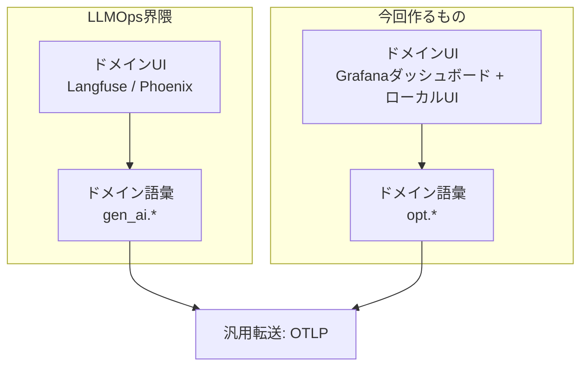
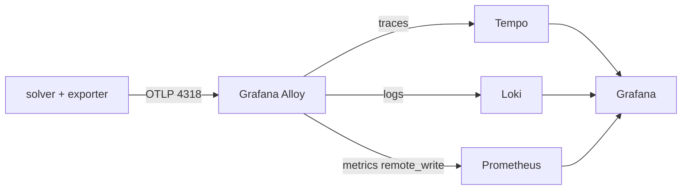
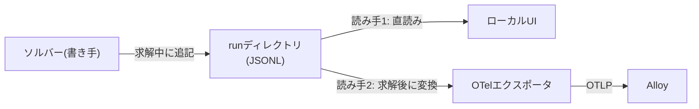

## TL;DR

- **数理最適化ソルバー**(MIP/MINLP: 混合整数[非線形]計画問題を解くエンジン)をOpenTelemetryで観測した話です
- 「収束しない原因を、制約式を1本ずつOn/Offして探す」という手作業を自動化し、**Grafanaのログパネルが犯人の制約グループをERRORで名指し**してくれるようになりました
- 過去タイムスタンプのテレメトリ送信は罠だらけでした(コレクタのAlloyが古いメトリクスを黙って捨てる等)。ハマりどころ4連発が本記事の一次情報です

## Intro

「最適化が収束しない。制約式を1本ずつOn/Offして犯人を探す」——数理最適化をやっている人なら一度はやったことがあるはずのこの手作業を、OpenTelemetry(以下OTel)の3シグナル(traces / metrics / logs)に乗せて自動化・可視化したら、**Grafana(OSSの監視ダッシュボード)のログパネルが犯人を名指ししてくれる**ようになりました。

この記事は**長時間バッチ・探索型計算という異分野にOTelを持ち込むときの設計判断とハマりどころ**を、実測ベースで共有するものです。

## MLOps・LLMOpsならぬ「OpsOps」が欲しかった

機械学習には実験管理(MLflow / W&B)という定番があります。LLMアプリにも、プロンプト管理と本番監視(OTel + Grafana)の定番が揃いつつあります。ところが数理最適化の運用——Operations Research の Ops、いわば **OpsOps** ——には、これに相当する定番がありません。(OpsOpsは適当です。あまりにもダサいのでいい名前はだれかがいずれ考えてくれるでしょう。)

数理最適化の実験管理には、たとえば次のような作業があります。

| やりたいこと | 変える軸 |
| --- | --- |
| 複数シナリオを一括で回して結果を見比べたい | インスタンス(入力データ) |
| ソルバーの設定をチューニングしたい | パラメータ |
| 解が出ない/遅い原因を突き止めたい(制約を1本ずつ外して犯人探し) | 定式化 |

どれも「**軸を1つだけ変えた試行を大量に作って突き合わせる**」という同じ形をしています。ここまではMLの実験管理と何も変わりません。しかし「自動で試行を回し、**途中経過を含む結果**と**試行の設定**を残しておきたい」という要求に応えてくれる、継続運用向きの観測基盤は、最適化ツールにはまず付いてきません。

無いなら作るしかありません。幸い、手本は隣にありました。「独自ドメインの途中経過を観測したい」という同じ問題を一足先に解いていた、LLMOps界隈です。

## LLMOpsがやったことを分解する — 汎用転送 + ドメイン語彙 + ドメインUI

LLMアプリの監視ツール(Langfuse や Arize Phoenix など)は、実はテレメトリの転送部分を自作していません。OTelの共通プロトコル **OTLP** でトレースを受け取り、その上に `gen_ai.usage.input_tokens` のような **semantic conventions(ドメイン語彙)** を定義し、LLM専用のUIを被せています。構造にするとこの3層です:



この分業のうまみは、いちばん下を規格に乗せた瞬間に、保存・検索・可視化・アラートが既製品から選び放題になることです。ドメイン側が作るのは「語彙」と「ドメインUI」だけでいい。

これを数理最適化に輸入します。図の右側、`opt.*` という属性群を自前の semantic conventions として定義しました。LLMOpsが主に使うのはトレースですが、同じレールは metrics / logs にも通っています。ソルバーでは3つ全部が活きました。

## ソルバーの求解プロセスは3シグナルに綺麗に写像できる

実際に載せてみると、ソルバーの求解プロセス(分枝限定法: 候補を木状に枝分かれさせて絞り込んでいく探索)は、OTelのデータモデルに素直に対応しました。

| OTelシグナル | 最適化での対応物 | 属性(`opt.*`) |
| --- | --- | --- |
| **Traces** | campaign(実験一式)=親スパン、各run(=1回の求解試行)=子スパン、暫定解(incumbent)更新=スパンイベント | `opt.run_id` / `opt.campaign_id` / `opt.axis.*` / `opt.status` |
| **Metrics** | 双対ギャップ・上下界(primal/dual bound)・探索ノード数の時系列 | `opt_gap` / `opt_primal` / `opt_dual` / `opt_nodes`(ラベルに run_id 等) |
| **Logs** | run完了サマリ + **診断エンジンの改善提案**(severity付き) | `opt_event=verdict` / `opt_group` / `opt_recipe` |

:::message
**gap(双対ギャップ)** は「今の暫定解が真の最適解から最悪どれだけ離れうるか」の保証値で、0%になれば「最適と証明できた」という意味です。以降の話はすべて「gapをどう0%に近づけるか」だと思って読んでください。

なお、属性名はOTLP上ではすべてドット区切り(`opt.gap` / `opt.event`)ですが、後述する保存先の Prometheus / Loki に入る際にアンダースコアへ変換されます。表の表記は「格納後の見え方」に合わせています(トレースの保存先 Tempo だけはドットのまま保持します)。
:::

ポイントは3つ目のLogsです。今回のパイプラインには、観測量から症状を判定して改善提案を返す診断ルールが入っています。課題は、この提案をどこにどう見せるかでした。やったことは単純で、**提案をseverity付きのOTelログレコード**(good→INFO / warning→WARN / serious→ERROR / critical→FATAL)として流しただけです。これでGrafana側ではログパネル1枚が「提案一覧」になります。しかも trace_id で相関させてあるので、提案から該当campaignのトレースへワンクリックで飛べます。

**提案を専用UIではなく「他のテレメトリと同じレール」に乗せる**——これがこの設計でいちばん効いた判断でした。

## 犯人探し(制約アブレーション)を campaign として自動化する

「軸を1つだけ変えたrunの束」を campaign と呼ぶことにします(OpsOps節の表の1行分が1つのcampaignに対応します)。本記事では3つ目の「犯人探し」を題材にしますが、仕組み自体は残りの2軸(シナリオ一括実行・パラメータチューニング)にもそのまま使えます。

犯人探しのcampaignはこう動きます。

1. baseline(全制約On)を求解して記録
2. 制約グループを1つずつ外したモデルを量産求解(グループは制約名の接頭辞から自動抽出)
3. status / gap / 求解時間の変化から verdict(提案)を自動判定
   - baseline が実行不可能 → 外すと解けた群は「**実行不可能性に関与**」(critical)
   - baseline の gap が残る → 外すと gap がほぼ閉じた群は「**収束ボトルネック**」(serious)

実測例です。バッチ反応器スケジューリング(Arrhenius式やら三重積やらが入った本気の非凸MINLP)を各15秒で回した結果:

| 外した制約グループ | status | 最終gap |
| --- | --- | --- |
| —(baseline) | timelimit | **140.8%** |
| demand(需要充足 n·s·X ≥ d、三重積=変数3つの積) | timelimit | **1.8%** |
| cooling(除熱能力) | timelimit | 188.5% |
| kinetics(反応速度論) | timelimit | 80.4% |
| energy(エネルギー収支) | timelimit | 36.1% |
| load(マシン負荷) | timelimit | 30.2% |

demandを外した瞬間だけgapが2桁落ちる。つまりこの三重積の凸緩和(ソルバーが内部で使う「解ける近似」)が緩すぎることが探索全体のボトルネックで、線形化や境界タイト化を打つべき場所はここだ、と機械的に分かります。モデルの中身を知らなくても総当たりで犯人が出る、雑だけど速いアプローチです。

この判定は人が読む前に、まず機械可読な結果文書として `results/campaigns/<campaign_id>/campaign.json` に残ります(根拠と直し方付き。以下は demand 分の抜粋):

```json
{
  "group": "demand",
  "severity": "serious",
  "verdict": "制約グループ 'demand' が収束ボトルネック(外すと gap がほぼ閉じる)",
  "evidence": "gap 140.8% → 1.8% (off 'demand')",
  "recipe": "この群の緩和が弱い。厳密線形化・変数境界タイト化・Big-M の Indicator 化を検討"
}
```

:::message
この verdict がGrafanaにERRORログとして流れてきます(severity は前述の写像で serious→ERROR)。Gapパネルは線1本が1run(=外した制約グループ1つ、左から実行順)です。どの線も高止まりする中、**demandを外したオレンジの線だけが0%近くまで落ち切っている**——この「1本だけ床に張り付く線」が犯人のサインです:
:::


*Suggestionsパネルに「制約グループ 'demand' が収束ボトルネック(外すと gap がほぼ閉じる)」が届く*

ローカルにも同じデータのマトリクスビューがあります。手元の単発調査はファイルベースのローカルUI、継続運用はOTel経由、という二層構成です(ローカルUIはGrafana無しでも動きます):


*同じverdictがローカルUIにも届く*

## アーキテクチャ: アプリはAlloyに投げるだけ

収集は Grafana Alloy(OTLPを受けて各バックエンドへ振り分けるコレクタ)に集約しました。アプリ側はOTLPを1箇所(Alloy)に投げるだけで、3シグナルの振り分けはAlloyの設定が担います。



traces は Tempo、logs は Loki、metrics は Prometheus——各シグナル専用の「保存庫」へ振り分けています。いずれも OTLP を受けるバックエンドの一つに過ぎない(規格ではない)ので、後から Jaeger や Datadog に差し替えてもアプリ側は無変更です。

Alloy設定の骨格はこれだけです:

```alloy
otelcol.receiver.otlp "default" {
  grpc { endpoint = "0.0.0.0:4317" }
  http { endpoint = "0.0.0.0:4318" }
  output {
    traces  = [otelcol.exporter.otlp.tempo.input]
    metrics = [otelcol.exporter.prometheus.default.input]
    logs    = [otelcol.exporter.otlphttp.loki.input]
  }
}

otelcol.exporter.otlp "tempo" {
  client { endpoint = "tempo:4317"  tls { insecure = true } }
}

otelcol.exporter.otlphttp "loki" {
  client { endpoint = "http://loki:3100/otlp" }  // Loki 3.x はOTLPネイティブ受け
}

otelcol.exporter.prometheus "default" {
  add_metric_suffixes = false   // ← 後述のハマりどころ
  forward_to          = [prometheus.remote_write.default.receiver]
}

prometheus.remote_write "default" {
  endpoint { url = "http://prometheus:9090/api/v1/write" }
}
```

## 実装の勘所: 「過去の実時刻」でテレメトリを組み立てる

ソルバーは求解中にイベントをファイルへ追記するだけ(書き手)にして、そのファイルを読む側を2つ用意しました。読み手1が前述のローカルUI、読み手2がOTelエクスポータです:



TensorBoardの書き手/読み手分離と同じ発想で、こうしておくと**テレメトリ送信の失敗が求解を絶対に止めません**。

一方この設計では、「探索イベントが起きた実時刻」でテレメトリを後から組み立てる必要があります。3シグナルそれぞれに流儀がありました。

### トレースは素直

`start_time` / `end_time` / イベントの `timestamp` を全部ナノ秒で指定できます:

```python
span = tracer.start_span("solve plant", start_time=t0_ns,
                         attributes={"opt.run_id": run_id, "opt.gap": 1.66})
span.add_event("incumbent",
               attributes={"opt.primal": 103.4},
               timestamp=t0_ns + int(12.3 * 1e9))  # 12.3秒時点の暫定解更新
span.end(end_time=t0_ns + int(15.0 * 1e9))
```

### メトリクスは罠

SDKの `Meter` API は送信時刻を自動で付与するため、過去時刻のデータポイントを載せられません。`MetricsData` を直接組み立てて exporter に渡します(公式データモデル準拠なので、Alloy/Prometheusはそのまま受けます):

```python
from opentelemetry.sdk.metrics.export import (
    Gauge, Metric, MetricsData, NumberDataPoint, ResourceMetrics, ScopeMetrics)

points = [NumberDataPoint(attributes={"opt.run_id": run_id},
                          start_time_unix_nano=t0_ns,
                          time_unix_nano=t0_ns + int(ev["time"] * 1e9),  # 実時刻
                          value=ev["gap"])
          for ev in events if ev["gap"] is not None]
metric = Metric(name="opt.gap", description="solver gap", unit="1",
                data=Gauge(data_points=points))
exporter.export(MetricsData(resource_metrics=[ResourceMetrics(
    resource=resource,
    scope_metrics=[ScopeMetrics(scope=scope, metrics=[metric], schema_url="")],
    schema_url="")]))
```

ただし、こうして組み立てた過去時刻のデータポイントを「いつ送るか」には別の罠があります(後述のハマりどころ2つ目)。

### ログはtrace相関がキモ

診断提案をスパンに紐付けて送ります:

```python
from opentelemetry._logs import LogRecord  # SDK側ではなくAPI側からimport(1.44)
from opentelemetry._logs.severity import SeverityNumber

ctx = campaign_span.get_span_context()
logger.emit(LogRecord(
    timestamp=end_ns,
    trace_id=ctx.trace_id, span_id=ctx.span_id,   # ← Grafanaでログ→トレースに飛べる
    severity_number=SeverityNumber.ERROR, severity_text="ERROR",
    body="制約グループ 'demand' が収束ボトルネック(外すと gap がほぼ閉じる)",
    attributes={"opt.event": "verdict", "opt.group": "demand",
                "opt.recipe": "この群の緩和が弱い。厳密線形化・変数境界タイト化・Big-M の Indicator 化を検討"}))
```

## ハマりどころ4連発(ここが一次情報です)

end-to-endで動かして初めて分かったことを全部書きます。

### メトリクス名に勝手に `_ratio` が付く

`unit="1"` のゲージは、Alloyの `otelcol.exporter.prometheus` が既定でサフィックスを付けるため `opt_gap` が `opt_gap_ratio` になります。ダッシュボードのクエリ名を素直に保ちたいなら `add_metric_suffixes = false`。

### 古いメトリクスはAlloyが黙って捨てる

これが最大の罠でした。`otelcol.exporter.prometheus` は**数分より古いデータポイントをstaleとして黙って落とします**。エラーも discard メトリクスも出ません。16時間前のrunをバックフィルしたら、traces と logs は入るのに metrics は `target_info`(リソース属性から自動生成されるメタ情報)しか届かない、という症状で気づきました。

:::message alert
**メトリクスは「求解直後に送る」設計にする。** 過去runのバックフィルで届くのは traces / logs のみ、と割り切ること。
:::

筆者はcampaign実行コマンドに `--otel` フラグを付けて、求解完了と同時に送るようにしました。Prometheus側の `out_of_order_time_window` は分オーダーの遅延を吸収するための保険です(吸収したいのは分オーダーですが、窓の値自体は余裕を持って大きめにしてあります):

```yaml
# prometheus.yml
storage:
  tsdb:
    out_of_order_time_window: 30d
```

### 古いログはLokiに「入っているのに見えない」

3時間より古いタイムスタンプのログは、Lokiに受理されているのに(受け口であるdistributorの受信カウンタは増える)クエリに出てきません。検索を担うquerierが、直近データを持つingesterに問い合わせるのは既定で3時間(`query_ingesters_within`)以内だけで、それより古いデータはチャンクがストレージにflushされるまで不可視になるためです(distributor / querier / ingester はいずれもLokiの内部コンポーネントです)。

`curl -X POST localhost:3100/flush` で強制flushすれば即見えます。「送れてるはずなのに出ない」ときは、ロストではなく**可視性の遅延**を疑ってください。

### `LogRecord` のimport場所(SDK 1.44)

opentelemetry-sdk 1.44 では `LogRecord` はSDK側(`opentelemetry.sdk._logs`)ではなくAPI側(`opentelemetry._logs`)からimportします。テスト用のin-memoryエクスポータも同様に変わっていて、`InMemoryLogExporter` はdeprecated、現行は `InMemoryLogRecordExporter` です。

## まとめ — 「観測対象は選ばない」がOTelの本領

- ソルバーの探索プロセスは traces(campaign=親スパン)/ metrics(gap曲線)/ logs(診断提案)に自然に写像できた
- **診断エンジンの「提案」をseverity付きログとして流す**と、Grafanaのログパネルがそのまま改善TODOリストになる
- campaign(軸を1つ変えたrunの束)の仕組みは、犯人探しに限らずシナリオ一括実行・パラメータチューニングにもそのまま使える
- 収集はAlloyに一本化。アプリはOTLPを投げるだけで、バックエンドはいつでも差し替え可能
- 過去時刻のバックフィルには段差がある: traces=自由、logs=flushまで不可視、**metrics=求解直後送信が必須**

この構成は数理最適化に固有のものではありません。長時間バッチ、シミュレーション、CI、データパイプライン——「途中経過に時系列と構造があり、終わってから分析したい計算」なら何でも同じパターンが使えます。`gen_ai.*` がLLMのために標準化されたように、自分のドメインの `xxx.*` を小さく定義してOTLPに乗せる。これがいちばん将来性のある持ち込み方だと思います。

実装一式(ソルバー計装・campaignドライバ・Alloy/Tempo/Loki/Prometheus/Grafanaのdocker compose・provisioning済みダッシュボード)はGitHubで公開しています:

@[card](https://github.com/ctenopoma/minlpkit)
