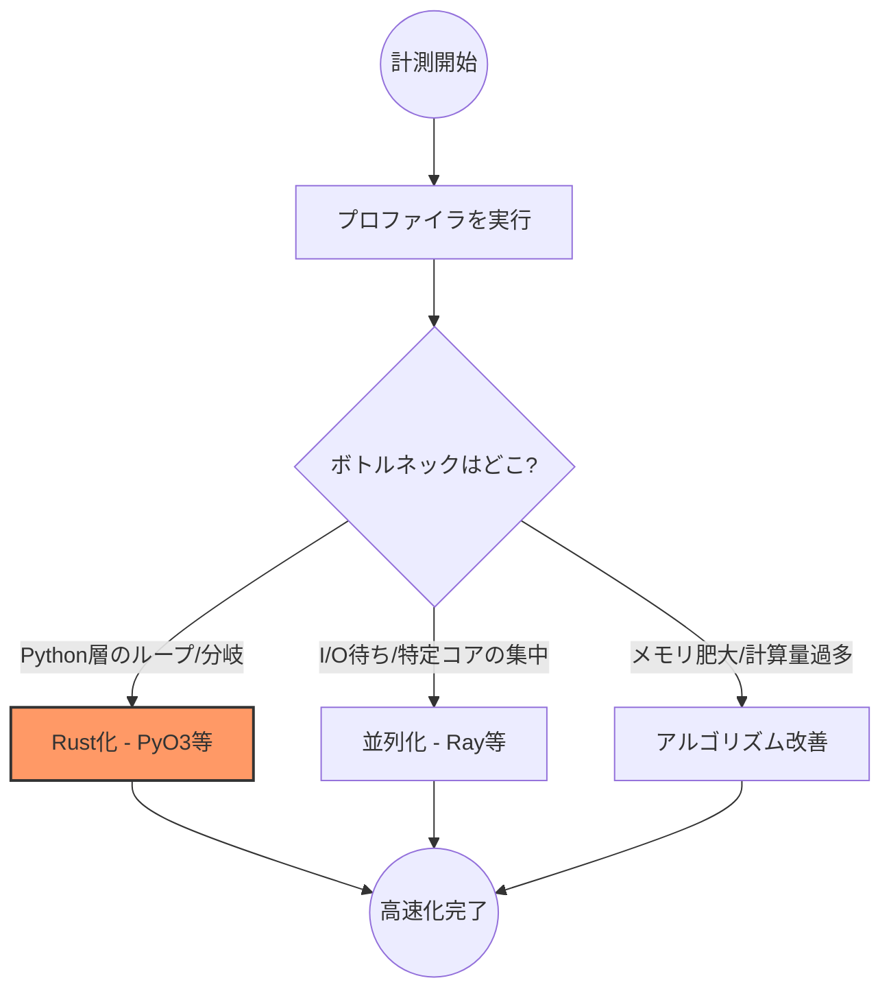

## はじめに：その「Rust化」は本当に必要か？

「Pythonで書いたこのプログラム、なんか遅くない？」と思ったあなた、まずは**5分だけ計測**してみませんか？

Pythonは開発スピードが速く、人員確保もしやすい優れた言語です。一方でインタプリタ型であるため、処理時間は早いとは言えません。

この記事では、Pythonのボトルネックを可視化し、改善するための基準を解説します。

## Pythonプロファイラ：目的別の使い分け

「推測するな、計測せよ」。
Pythonには優秀なプロファイラが揃っています。目的に合わせて以下のツールを使い分けるのが最短ルートです。
（※ScaleneはLinux環境を推奨します）

| 分析の目的 | 推奨ツール | 特徴 |
| :--- | :--- | :--- |
| **時系列・実行フロー**の分析 | **Viztracer** | 関数呼び出しの関係やI/O待ちを可視化 |
| **計算資源**(CPU/メモリ)の分析 | **Scalene** | 行単位の負荷特定、AIによる最適化助言 |
| **並列計算**(Ray)の分析 | **Ray Dashboard** | 複数ノード・コアの利用状況を可視化 |

### 1. Viztracer：プログラムの「流れ」を診る

Viztracerは、タイムライン形式で「どの関数が・いつ・どれくらい」動いたかを可視化します。

**チェックポイント：**

* **妙に横に長いバー（関数）**：処理が集中しているボトルネックです。
* **細かく大量に並んでいる隙間**：関数の呼び出しオーバーヘッドが積み重なっています。ここをRust化すると劇的に改善する可能性があります。

### 2. Scalene：ソースコードの「行」を診る

Scaleneは、ソースコードの各行がどれだけCPUやメモリを消費したかを詳細に表示します。

**チェックポイント：**

* **Python vs Native**：Scaleneは「Python層」と「Native層（C拡張など）」を色分けします。**Python層が赤く染まっている行**こそ、あなたが改善すべき箇所です。
* **AI最適化アドバイス**：Scaleneはどのように修正すべきかの提案も行ってくれるため、改善のヒントになります。

---

## 計測結果から導く「3つの処方箋」

プロファイリングの結果から、最適な対策を選択します。

| 改善手法 | プロファイラの主な所見 | 狙い |
| :--- | :--- | :--- |
| **Rust化** | 高頻度な関数呼び出し、Python層のCPU占有 | 実行オーバーヘッドの徹底除去 |
| **並列化 (Ray)** | 特定コアのみ集中、全コアの低利用率 | 複数コアへの負荷分散 |
| **アルゴリズム改善** | 指数的な時間増加、メモリの急激な肥大 | 計算ステップ・無駄な処理の削減 |

### 🔍 具体的な判断ケース

#### 1. CPU使用率が高く、シーケンスに処理が並んでいる場合

* **対策：** 一部をC++やRustに置き換える。
* **特に有効：** Pythonの`for`ループや`if`分岐が数百万回実行されている箇所。インタープリタのオーバーヘッドを削るだけで劇的に速くなります。

#### 2. CPU使用率が低く、処理が詰まっている場合

* **対策：** `Ray`による並列化。
* **特に有効：** 互いに依存しない独立したタスク（画像処理やデータ変換など）が大量にある場合。

#### 3. CPU・メモリ使用率が異常に大きい場合

* **対策：** アルゴリズムの抜本的見直し。
* **特に有効：** 計算量が $O(n^2)$ 以上になっている、または不要な巨大オブジェクトを生成している箇所。

---

## Rust化のススメ

計測の結果、「ここはRust化すべきだ」と判断した方へ。
Pythonから呼び出せるRust製ライブラリ（PyO3）を爆速で立ち上げるためのテンプレートを用意しました。

@[card](https://github.com/ctenopoma/python-rust-copier)

「推測」を「確信」に変えてから、最高のパフォーマンスを追求していきましょう。
